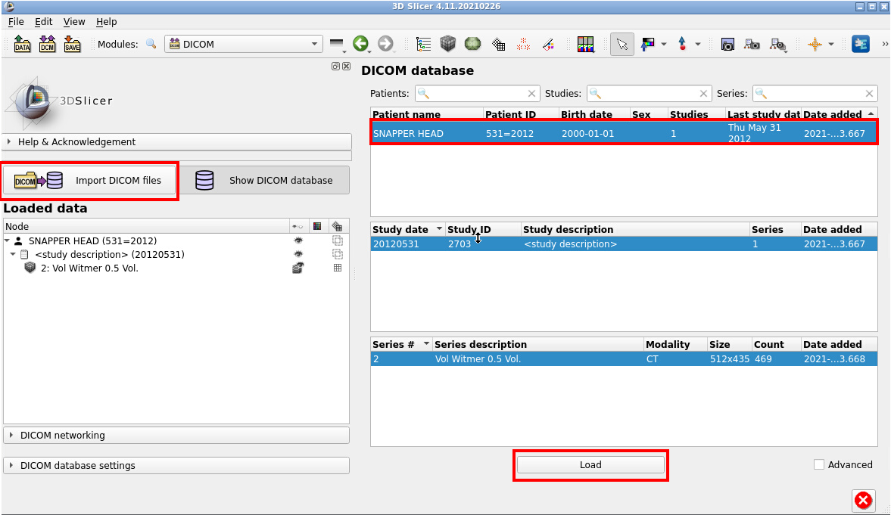

## Dealing with DICOMs

[DICOM is a complicated standard](https://www.dicomstandard.org/current) for storing and exchanging medical images. While it is ubiquitous for clinical imaging research, it is not a common format for high-resolution imaging of organismal structure via microCT.

Slicer has an extensive support for DICOM format through the [`DICOMBrowser` module.](https://discourse.slicer.org/t/new-dicom-browser-is-ready/8819). You need to understand a few things about DICOM data, particularly if you are working with clinical data. 
1. DICOM format may contain sensitive, private information even if the images themselves are of non-human species (e.g., data coming from vet clinics). 
2. DICOMBrowser will create a local database on your computer, which contains all the imported DICOM files and the associated metadata. If you are doing human subject research, make sure you have necessary privacy protections in place (particularly if this is a shared computer). 
3. Not all DICOMs are created equal. Slicer will not load any DICOM that's not complaint, and it will require patching them (correcting them). See this blog for more information about an example from MorphoSource. (https://blogs.uw.edu/maga/2017/04/morphosource-data-and-dealing-with-dicom-series-in-slicer/ Note that this blog is more than three years old, and shows the old DICOM interface, but the challenges are the same).

Because of these reasons, we actually suggest SlicerMorph users to use an external DICOM converter, which will take a DICOM series, strip the metadata and save it in a Slicer compatible NRRD (or NIFTI) format. The tool is called [DCM2NIIX](https://github.com/rordenlab/dcm2niix/releases), and is available as a command line tool for Windows, MacOS and Linux. Because it is a command line tool, it can be used to do bulk conversion of many datasets too. There is also a Slicer extension (DCM2NIIXGUI), which is bundled with SlicerMorph, but it is as almost easy to use the command line tool. 

We provide one small [sample DICOM](https://app.box.com/s/7jxziv9x6z34yee9ke8w0sincuw02zek) from The Cancer Imaging Archive. After you unzip the contents of it, you can import this sequence through the DICOMBrowser, by clicking on **Import DICOM files** and navigating to the folder **04-29-2011-ThoraxAThoraxRoutine Adult-66805**. To load the DICOM series into Slicer, click "Examine" and the "Load" button. 

