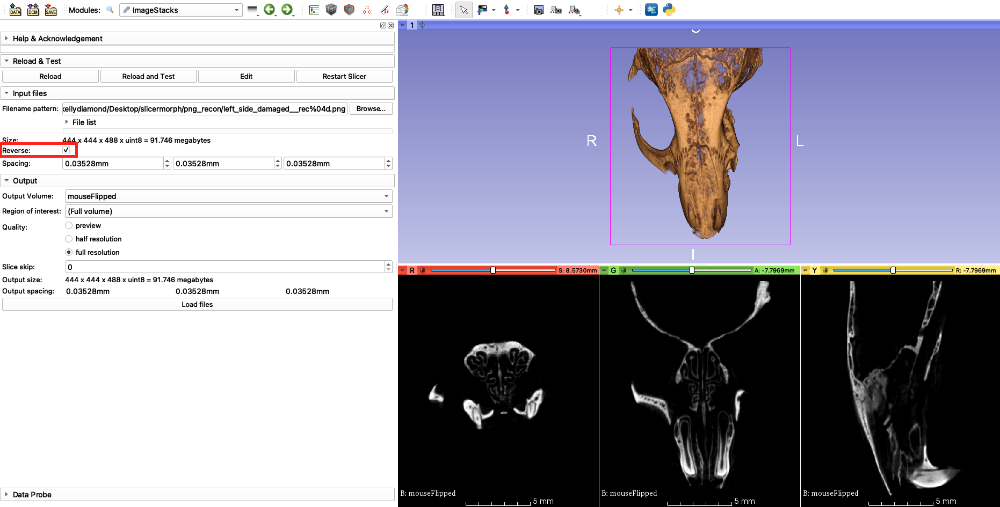
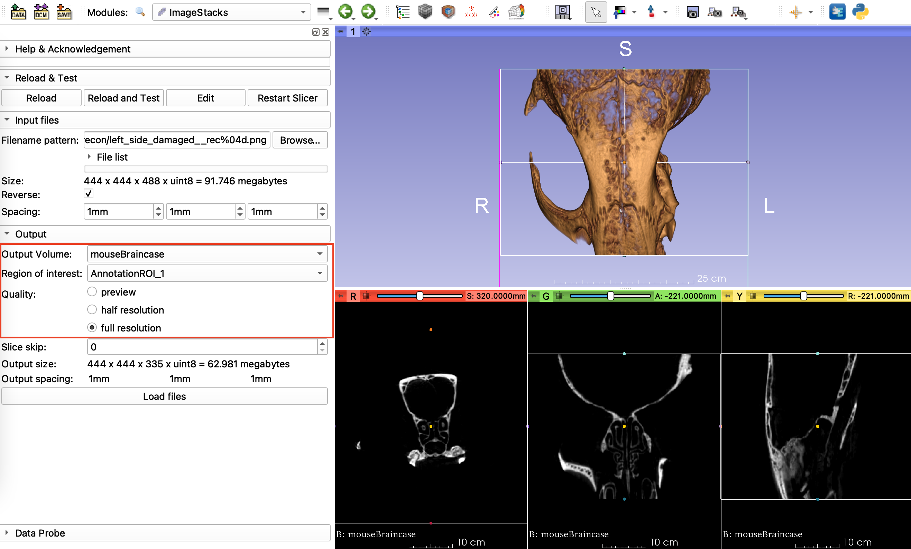

## ImageStacks
This is a SlicerMorph specific utility to import non-DICOM image sequences (TIF/PNG/JPG/BMP) into 3D Slicer. It provides additional features such as only loading a subset of the data using ROI, downsampling, skipping slice(s) along the Z plane, and reverse the stack order. You can also specify the voxel spacing for your dataset at the import time. `ImageStacks` always produces a ScalarVolume (single channel), so that volumes can be immediately visualized or can be processed with `Segment Editor`.

To use the `ImageStacks` module in SlicerMorph, first go to the `Sample Data` module and download the *Bruker/Skyscan mCT Recon Sample* data OR you can download the same file here: <a href="https://app.box.com/s/zvs162oja7tzszesmygnqs15t631y15m/file/701646040827" target="_blank"> Sample_microCT_stack.zip</A>, and unzip to a location. 

Then find the `ImageStacks` under **SlicerMorph->Input and Output** menu folder and:

1. Click the **Browse...** button and select a *PNG* file in the folder you just unzipped.

2. Image spacing in this dataset is provided in the accompanying left_side_damaged__rec.log file as 35.28 micron. Enter this value in millimeters as 0.03528 for all three axes
3. You leave the **Output Volume** blank, which will use the filename prefix. Or you can choose to create a new volume name. 
4. To preview a low resolution version of your file make sure the **preview** quality option is selected and click **Load Files** and see that all three slices viewers contain a low resolution version of our data.
5. To visualize what the specimen looks like, go to `Data` module and drag and drop  **left_side_damaged__rec** into the 3D viewer (Note: We will cover `Volume Rendering` module in great detail tomorrow. For the time being, this is all you need). You may need to hit the cross hairs and push pin directions (red boxes) to center your rendered image in the 3D widow.

Notice that the resultant rendering show the damage to the zygomatic arch in the **right side** of the specimen. Curiously, the specimen is named **Left side damaged**. 

Indeed you can check what the real specimen looks like by going to the link below, and confirm that it is indeed the left zygomatic arch that is missing. 

<a href="https://app.box.com/s/zvs162oja7tzszesmygnqs15t631y15m/file/701653679714"> **Picture of the specimen in the sample stack** </A>

This is a standard problem of using image stacks to convey volumetric data. There is no convention of what the **top** of the stack versus **bottom** of the stack is. It is all relative and depends on the scanner vendors' convention. To mitigate this issue, `ImageStacks` offers a **Reverse** option, which basically flips the stack ordering and -in this case- corrects this mirroring.

This is a common problem across 3D visualization programs, when image sequences are used to present 3D data. Because of this, it is very important to have independent confirmation of import procedure. Look for asymmetrical structures on your specimen and confirm that they appear on the correct side in the 3D rendering. After a successful import (correct specimen size, orientation) you should immediately save your data in a proper 3D volume format that will retain this information (which will be our next topic). 

Once you have reversed your image and you want to visualize the full resolution version of your entire file you can go back to the `ImageStacks` module, change the quality from **preview** to **full resolution**

### Using ROI with Image Stacks

Let's say you have a large file and you only want to visualize a portion of the total scanned volume at full resolution, such as only segmenting the braincase of the mouse. Before loading in the full resolution volume, we can do that using a region of interest on the preview resolution image we imported in the previous step. First in the `Data` module click the eye ball button to view the **AnnotationROI** assoicated with your reversed image (Mine is called AnnotationROI_1) and use the colored circles so that the ROI excludes the mouse rostrum (nose). Now go to the `ImageStacks` modlue and select the same **AnnotationROI** for the Region of interest and create a new output volume (I've named mine mouseBraincase), change the Quality to **full resolution** and click **Load Files**

Notice that the slice views show only the volume in the region of interest and are now full resolution. If you have an articulated specimen (e.g., a full body scan of a fish), and you want to segment only the skull (or a specific region), this is a trick you can use to reduce the memory consumption. Segmentation may require 6-10X more memory compared to your volume size (if `ImageStacks` reports estimated memory usage is 2GB, then you may need up to 20GB in memory to segment the data in full resolution). 

### Further exploration

1. Try importing the same volume with different ROI under different names. Observe that they retain their correct spatial relationships with respect to the full volume. That's because slicer retains the correct spacing and necessary offset values for the origin, so that these partial datasets still line up with the full image. 
2. Try drag and dropping one slice from the folder where the data sits into Slicer. (HINT: When asked whether you want to use ImageStacks to import data, say yes)
3. Try using the `ImageStacks` tool to import any data you might have or downloaded from the MorphoSource. 

## SkyscanReconImport
Note that while **reverse** corrected the mirroring issue, specimen is not correctly oriented in anatomical space (e.g., Inferior is marked as the front of the specimen). Again this goes back to the issue of microCT scanners not having coordinate convention. With a trial and error you can find the right transformation necessary to put the specimen into the correct space for your particular scanner. We have calculated that for our Bruker/Skyscan microCT and provide another module called `SkyScanReconImport` for the Skyscan users. 

To use this tool, find the `SkyScanReconImport` and simply point out the file browser to the scanner log (**left_side_damaged__rec.log**) provided in the folder. Module will read the correct image spacing, filename prefix provided in the log and automatically populate these fields, so no additional user intervention is required. 

When you enable the Volume Rendering as described above, you see that the anatomical orientation labels correctly line up with the specimen. 

**NOTE** For this transformation to hold, the specimen should be oriented in the scanner bed such that the anterior of the specimen should be closest to the scanner, and operator should be looking down to the dorsal (top) surface (see the specimen picture above). We only tested this with Bruker 1076. So if you are Bruker users, we appreciate if you can provide further feedback about whether this tools works for you. 

### What about getting data from other scanners' proprietory formats?

In addition to as image stacks, different microCT vendors output data in different formats (e.g., multi-frame tiff) or into their own proprietory format (e.g., Scanco). While multiframe tiff is supported, in other cases you may want to use `RawImageGuess` module, which is another extension bundled with SlicerMorph, to import foreign data. In a nutshell, `RawImageGuess` allows you to guess key image information such as image dimensions, data type, header size in a convenient and interactive way. [This video shows it in action](https://www.youtube.com/watch?time_continue=3&v=ajpOQEAyWkA&feature=emb_logo).

Knowing the correct values for image dimensions and data type will greatly expedite the guessing procedure. See this blog for [an alternative approach to importing data from Scanco by using information from their log files](https://blogs.uw.edu/maga/2018/09/importing-microct-data-from-scanco-into-slicer/), which predates the RawImageGuess module. You can just take these values and directly enter into the `RawImageGuess` module and quickly import the data into Slicer.

See this link for more information about [`RawImageGuess` extension](https://github.com/acetylsalicyl/SlicerRawImageGuess/).
