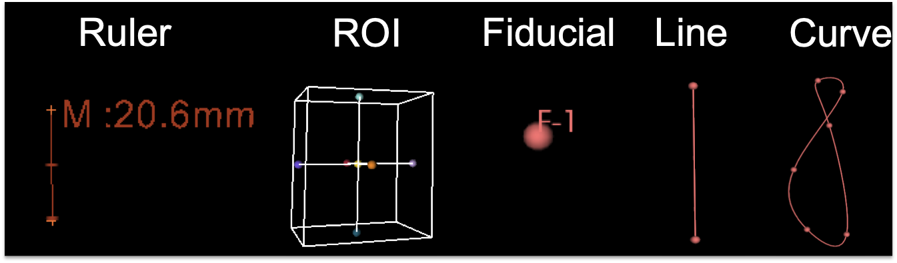
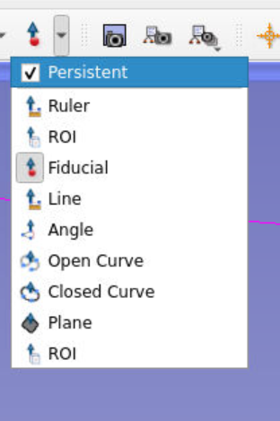

## Measurements and Visualization 

### Overview of markups
* Previous versions of Slicer (Stable 4.11 and earlier) supported only Fiducial markups.
* New stable version of Slicer (4.11.20210226) has several markup types: lines, angles, ROIs, open and closed curves, and planes, as well as improved handling of large numbers of markups (thousands range). 

* Updates to `Markups` module are ongoing so check back for updates

### Markup Types

**Fiducials:**
Place a single landmark point.

**Lines:**
Sequentially place two points, creating a line between them.

**ROI:**
Place two points sequentially that specify corners of a rectangular cube defining the region of interest. The size and shape of the rectangle can be adjusted after placement.

**Angles:**
Place three points sequentially. This forms two vectors where the second point placed is the vertex. The angle beween the two vectors is displayed.

**Open and closed curves:**
Sequentially place points. A curve will be fit to the points and updated as additional points are added. If the closed curve is selected, the first and last points placed will be connected. 

By default, curve fitting is done using Spline function. Other alternatives are: Linear, Polynomial, or Shortest-distance on a surface. Curve Type function can be adjusted under **Curve Settings** section of the `Markups` module.  

**Planes:**
Click two points to define a line, for the 3rd point move perpendicular to the line defined by the line and you should see a rectangular plane appearing. 

-----

### Markup Placement
  * Slicer has three mouse modes: Translate/Rotate, Adjust Window/Level and Place. 
  * The icons in the mouse mode toolbar at the top of the main GUI allow to switch between these modes.
  
 
 * Translate/Rotate mode is the default interaction mode. This mode allows interaction with loaded data (pan, zoom, rotate)
  * Adjust Window/Level mode controls the Window/Level for the volume in slice views (red/green/yellow or axial, coronal, sagittal). 
  * Place mode allows to place one object then switches modes back to Transform mode. Fiducial is the default object.
  * If there is no active Markup node, one will be created with the first placement. Curve points and fiducials will be added to the active Markup node, if one exists. 
  * Place mode can be made persistent by clicking the checkbox in the mouse mode toolbar.
  

----

## Markup Management and Important Considerations for Data Collections
Fiducial points and control (anchor) points of lines, curves, angles and planes can be accessed and manipulated using the `Markups` module. 

* In the **Create menu**, a new markups node can be created for fiducials, lines, angles, curves and Planes. 

* **Note** that the placement icon in the mouse controls on the top bar creates a new markups node if there is no markup node in the scene or the selected markup node is not matching to the placement type. If you want to add new points to an existing node, you should select the node from list in the `Markups` module, and use placement icon. Alternatively, if you want to create a new set of landmarks, you can create a new Fiducial Markup node using the "Create fiducial markups" button from inside the `Markups` module panel. Also note that creating a new markups node changes the mouse mode automatically to placement mode for that node type. In practice, you should create markup nodes for different sets (e.g., Skull_LMs, Mandible_LMs, etc). Any set of landmarks that you will analyze indepedently should have its own MarkupFiducial node.

* In the **Display** menu (expand it if it is collapsed), you can set the visibility, opacity, glyph and text size of a markup node. Depending on the markup type, you can also change the line color, thickness, font type, 2D and 3D display properties.

* Once you find an optimal settings for our screen resolution and sample size, you can hit the **Save to Defaults** button, and Slicer would remember these settings in your future sessions. You can click to **Reset to Defaults** to go back to the Slicer's default size. Expand and explore the **Advanced** tab for additional options. 

* If you want to translate (move) or rotate the entire node (all control points together), you can use **Interaction handles** setting from Display menu by enabling the **Visible** checkbox. 3 orthogonal vectors (the directions depends on the configuration of the markup node in space) and rotation arcs appear in 3D and 2D views at the center of your control points. Using the vectors, you can translate the node (all points); and using the arcs, you can rotate the node. Rotation may not be sensitive enough if interaction handles are too small. The size of the interaction handles is controlled by the Glyph Size option of the Markups node. Interaction handles is especially useful for Planes: you can "move" a plane without changing its normal vector.

* In the **Control Points** menu, use the table to adjust visibility, labels, and position of individual fiducials points. Because there is no undo for markups actions, when you are actively landmarking, we suggest setting the lock icon so that you don't accidentally grab an already placed LM and modify it.

* You can use **Click to Jump Slicess** option to see where the fiducial is in slice views. This is a very useful feature, if you are landmarking directly on the 3D volume (e.g., a CT scan) as oppose to a 3D model. 

* You can copy/paste/delete control points across fiducial nodes by highlighting the rows (use ctrl to select multiple rows), as if in a regular spreadsheet.

* Expand the **Advanced** section of the **Control Points** section and explore how you can move highlighted control points up or down in the list. You will find this feature useful when you miss a landmark in the sequence, and place it later. Like most other GMM programs, SlicerMorph's GPA module assumes that all samples are landmarked in the same order. Further down you can use Name Format field to modify the fiducial labels in bulk. Current convention of %N-%d means that landmarks are named by the node name (e.g., MarkupsFiducial) followed by the (-) sign and the number indicating the sequence they are landmarked. If you want a shorted label, you can just switch to %d and hit apply to rename the existing ones. The subsequent fiducials will follow this format.

* In the **Measurements** menu, you can calculate different statistics for different markup nodes. One of the useful statistics is the length of open/closed curves and area of a plane or a closed curve. 

* In short, `Markups` module of Slicer is very powerful, but has a lot of options. Make sure to explore them in depth to avoid frustration later on. 

----

## 3D Models and Curve-based Semi Landmarking
3D Models (also called Mesh) data in Slicer is displayed using the `Models` Module, as we have seen in Day 1. Fiducial points are automatically placed on the surface of the a loaded mesh and will be constrained to the surface when they are moved. The control points for other markups are also constrained to mesh surfaces when present. You can of course peel off the control points from the surfaces if you move them far enough, but otherwise they will glide on the surface of the model. 

### Resampling a curve on the surface of a model to create Semi Landmarks
1. Load the Gorilla Skull Reference Model under the SlicerMorph tab of the `Sample Data` module (you will need SlicerMorph installed to see this option in the menu). Load the model and the landmarks into the scene.

2.Center the dataset in the 3D viewing window using the button at the top left of the window. Optionally, change to the 3D only layout.

3. Open the `Models` module. Experiment with changing the color and opacity of the skull.

4. Go to `Markups` module and rename the landmarks using the Naming option under Control Points, so that they have only numbers as names. Change the color of the landmarks as well.

5. Select open curve placement mode from the upper menu bar and place a curve on the cheek bone starting from landmark **35** using approximately 10 points. Note that the control points are snapped to the mesh, but the curve itself may lie above or below the mesh surface. 

6. In `Markups` module, select the open curve node and expand the Resample Menu. Select **Create a new markups curve** from the Output node selector and set the number of resampled points to 50. In the **Constrain points to surface** menu, select the loaded gorilla mesh. Before resampling, confirm that the curve to be resampled is selected as the active node in the node list from `Markups` module. 

Click the **Resample curve** button to generate a new open curve with 50 points constrained to the mesh surface. This results in a curve that is closer to the actual surface curvature than the original. 

Check the lengths of new curve and the original curve using Measurements menu.

----
### Example 1: Using Markups for Measurement

In this example, we will place a closed curve on one slice of a MR scan and measure the area of the curve.

1. Select the `Sample Data` module and load the MRHead volume. 

2. Select the closed curve markup mode and place a curve around the brain tissue in the red view window (axial slice). You can change the Slicer layout to red window only for better detail.

3. Calculate the area of the brain using Measurements options in `Markups` module.

 
### Example 2: Using the `Line Profile` module
In this example, we will use the `Line profile` module to place a line and examine the intensities of a volume along the line.

1. Check that the MRHead volume from example 1 is loaded in the scene.

2. Select the line markup mode and place a line along an area of interest in one of the slice views. This could also be done using an open or closed curve.

3. Select the `Line Profile` module. Choose MRHead as the input volume, the line you created (by default named **L**) as the input line and choose the options to create a new output table and plot series. If needed, you can adjust the number of samples along the line using the Line resolution slider. Select the **Compute intensity profile** button and a line plot of the intensity volume intensity values sampled along the line will be displayed. From the `Data` module you can also view the results as a table by clicking the eyeball next to the name of the table node.

