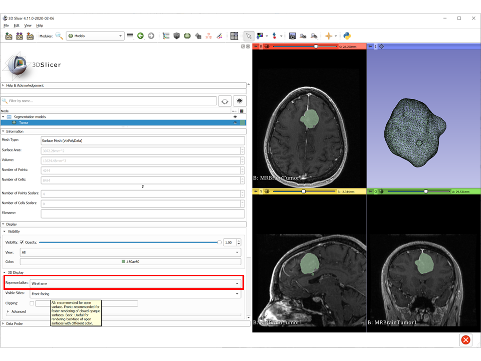

# Segmentation, conversion to 3D models and beyond. 
## Segmentations

Segmentation is one of the most useful things you can do with Slicer! It could be automated / semi-automated or fully manual! Most of the time, you will need a semi-automated approach. 

A segmentation is an abstract representation of stuctures in an image. It usually contains more than one segment (usually non-overlapping) annotated with different colors in 2D and 3D. In Slicer, ``Segmentations`` and ``Segment Editor`` modules will be our friends during this lab. 

### Segmentation vs. LabelMap vs. Model
A segmentation is a group of segments. It needs a "Master Volume" to work on. You can create segmentation based on the intensities of voxels (or pixels) and their temporal/spatial properties (nearby voxels/pixels with similar intensities belong to the same segment). 

A *label map* is an *image* where the value of each voxel/pixel is the label of the segment that voxel/pixel belongs to. A label map for an image is the same size/dimensions (and even physical space if the format of the image allows it) as the image and assigns exactly one label to all voxels/pixels. Usually 0 is the background. A segmentation does not have these constraints, segments can overlap, do not need to cover all pixels/volxels and can be represented in different ways (it doesn't need to be an image). Label maps are very useful for storing segmentations (they are the same size as images and usually have very few pixel values, a 5-segment segmentation needs only 6 integers to encode and can be compressed efficiently). Label maps are also useful for some analysis methods. 

A *model* is a *surface mesh* with points and polygons (usually triangles) and a very useful representation for segments. Usually, the outer surface of a 3D segment is represented with a closed surface mesh. Models are good for visualization and some analysis methods. However, they can be quite large and cumbersome to read and write. (Side note: existing mesh formats are inefficient for I/O and they don't have "units" and "physical space" which are critical for medical applications. One needs to be very careful playing with meshes converted from volumes.)

In Slicer, you will first create a Segmentation - which can be converted to LabelMap or a Model depending on what your analysis needs.

## Segment Editor 

:pencil2: Load MRBrainTumor1 data from `Sample Data` . Let's segment that tumor. 

* Find ``Segment Editor`` module from the list, through search function or from the Core Modules shortcuts. 

* Name your segmentation (optional) and select your master volume, MRBrainTumor1 in this case. 

* Add a segment by clicking ``+Add`` button. It will be named ``Segment_1`` if it is the first one you created and the numbers will keep increasing as you add more segments. Let's segment the tumor in Segment_1 so rename the segment properly (as Tumor for example). You can rename the segment by double-clicking on its name. 
You can also change the color of the segment by double clicking on the color next to its name, it is nice to have contrasting colors for the segments so that your visualization is easy to look at. The colors do not mean anything other than visualization. Side Note: If you save your segmentation as a LabelMap, the order of the segments will matter (they will have the labels 1,2,3..n based on the order) and if you don't save your color map separately for Slicer, they might be colored differently next time you load your LabelMap.

Slicer have quite a few color maps you can pick and choose from.

As soon as you add the segment, the tools in the ``Segment Editor`` are enabled. Click on the first one, "Paint".

* Each Effect (or tool) is useful in a different scenario (some more than others) and you will have favorites soon. But first things first: 
  * Slicer gives you parameters and options for each tool. Use them. 
  * Undo/Redo buttons allow you to take back some steps but they are limited (I guess 8?).
  * Masking is important. Right now you have one segment but you will have more than one and if you are not careful, you can erase or cut or overwrite other segments unintentionally. Set these options carefully EACH TIME before you apply an effect /tool. I like to keep the ""Modify other segments" option in "Allow overlap". This is one mistake that's hard to recover from... :sob:
    * Overwrite all: The new segment can overwrite the others if it overlaps with them.
    
    * Allow overlap: none of the other segments are overwritten so brown/orange segment is overlapping with the green and yellow one.
    
    * Overwrite visible: I made the green and yellow segments invsible, painted with the blue one, and it overwrote the brown/orange one. But when I turned the visibility of the green and yellow segments back on, they were overlapping with the new segment and not overwritten. 
    
    
     
  
:pencil2: Explore some of the Effects (tools). 
  
* **Paint/Erase** is very useful as starting point of some semi-automated methods. It is literally painting over pixels (or voxels). Important thing is to adjust the diameter and select between sphere and circle brush. 
   * Try using it without changing anything: simply paint over a slice in any of the red/yellow/green slice views. Then, move between slices (mouse wheel on any of the red/yellow/green views or slider at the top of them). Then, change it to a sphere brush and try again. When it is a sphere brush, you are painting/erasing in 3D. Note the spherical or disk-shaped brush in 3D view when you are painting in slice view. 
   
   
   
   
   
   * Click on the "Show 3D" button at the top. This creates a surface model visualization of your segmentation. It may take a few seconds. Mostly it is the smoothing operation that takes a bit long. If you turn off the smoothing by clicking the little arrow next to the Show3D button, you will notice the rendering will "pixelate". 
     * Although it is possible to paint/erase in 3D, it is extremely clunky (for technical reasons). 3D rendering needs to be updated as you edit it, and it is computationally expensive to do so. So, I recommend using it sparingly to check your segmentation or for limited operations (like the Scissors tool we'll play with in a minute).
     
    
    
    
    
* **Fill Between Slices** is a useful effect you can use in combination with other effects that work on one slice at a time. If you found that Paint, Level tracing or Grow from seeds effects work on your segmentation task, you may want to use them to segment a 3D area of interest slice by slice but it may take a long time to do so. Don't despair! Fill Between Slices effect can cut down your work considerably. Instead of segmenting each slice, you only need to segment a couple and let this effect *Fill Between Slices*. 

  * Start with any tool you like (Paint, Level tracing, Grow from seeds) and segment the tumor on two axial slices that are not adjacent but also not too far apart. 
   
  
  * Go to Fill between slices effect and click "Initialize". This effect *interpolates* between the slices in the selected segment (in our case Tumor segment) and fills between them. The borders of the filled 3D shape does not follow the intensity of the image, in other words, it is not smart. It shows you a preview of the filled segment in a more transparent color which you can adjust using the slider between inputs and results. 
   
   
  
  * Until you click "Apply" button, you can modify the inputs (i.e. slices you painted) and if Auto-update checkbox is checked, the effect will update the filled region in the background. Lets keep painting slices. Notice how the proposed segmentation in more transparent green color updates each time you paint a new slice. Once you are finished, go back to Fill between slices and click apply which overwrites your segment (Tumor) with the proposed one.
  
   

* **Threshold** is one of my favorite tools to begin any segmentation. It creates segments based on an intensity range. In most modalities, the intensities of certain anatomical structures are known. It is also interactive, so you can play with the range until you found a working set. There are also automatic threshold methods that find the min/max values based on intensity histograms.
 
 :pencil2: Click on Threshold and find a good range that works for the tumor in the image. Note how segmentation overlay on slices flashes while you change the range. It doesn't need to be perfect. Make sure "Show 3D" is turned off to speed things up. 

  
  * Automatic threshold and Local histogram options let you make a more informed decision about the threshold range. Automatic threshold offers a couple algorithms for selecting minimum and maximum intensities for the region. Most algorithms find a cutoff point, and you can use it either as a minimum or a maximum for the threshold range by changing the option from the drop-down menu on the left.
  
 
  * **Local histogram** shows you the intensity histogram of a selected image region and lets you select an intensity range on the histogram. This is useful when you want to select intensities based on a region, instead of the whole image as automatic thresholding does. By constraining the region, you can make sure the area of interest will end up being a a larger peak compared to the whole image histogram. You can use a box, a circle, a line or a free-shaped region (draw) to select a region on slice views. For example, you can use Draw tool to select the tumor region. The histogram will have several peaks, but since the tumor looks brighter, we can assume that the peak on the higher intensity range corresponds to tumor. The automatic thresholding algorithm is now applied to this region and range is updated. Alternatively, you can select the intensity range directly on the histogram.
  

* **Local Threshold** adds more control to Threshold effect by allowing to select a region, visualizing the intensity histogram, using the histogram to pick the range of intensities for thresholding and adding "candidate" regions by Ctrl+clicking on the image. See [this thread](https://discourse.slicer.org/t/new-segment-editor-effect-local-threshold/9233) and [youtube video](https://youtu.be/cevlMLyhfK8) from Perk Labs introducing the effect.

* **Islands**: Sometimes there are more than one structure in the same intensity range, if they are not "connected", it is easy to separate them. An island (connected component) is a group of pixels/voxels with the same label and that are "connected". Let's explore the options:
  * Keep largest island: removes all islands except the largest (defined as number of pixels/voxels) connected component. 
  * Remove small islands: removes smaller islands (smaller than the "minimum size") and still ends up with one segment that can be multiple islands.
  * Split islands to segments: creates a new segment for each island that is larger than the "minimum size". This is useful if you have multiple islands you are interested in and want to decide on island-by-island. This creates new segments.
  * Keep selected island: let's you click on the image / on the segment. Keeps the island that includes the pixel you clicked, and removes rest of the islands from the segment. This is also nice if you think the structure you are interested is actually one island, not splitted. 
  * Remove selected island: opposite of keep selected island.
  * Add selected island
  
  :pencil2: In my case, I kinda know that tumor is separated from the skull and currently my segment contains both the skull, some nasal airways and the tumor. I am going to use "Keep selected island" and click on the tumor. Then I can visualize it by clicking Show 3D and decide if I want to "Undo" or not. 
  
  
  
  
  So, I am happy with the segmentation. I can clean up the vascular structure attached to the tumor and make it work. Try your own methods and experiment!
  
  * **Scissors** is the next stop on our tour. Now I want to clean the extra voxels from my segment, but I don't want to do that using eraser slice-by-slice and I am not good with spherical eraser which can remove stuff I don't see in other slices. So scissors give us more flexibility on what to remove. The idea is to select a region in any size and different forms and remove it. It has different options: 
   * Operation: You can select the region to remove or keep or even fill. 
   * Shape: You can select a free-form region, a circular region or a rectangular region.
   * Slice cut: You can remove/keep/fill regions in an unlimited "depth", in positive direction or negative direction. This needs a bit of explanation. The structures we play with are in 3D space but our screens show us a 2D image. In slice views, the axes are pre-determined: in the red slice ciew the unseen 3rd dimension is supero-inferior axis, in the yellow it is right-left, in the yellow it is antero-posterior. In 3D view, the 3rd unseen dimension (imagine the direction from the screen towards your face and towards behind the screen) is whatever orientation your rendering is. So when you select "Unlimited" in slice cut option, it creates a region in unlimited size in this 3rd dimension. If you are cutting in 3D view, it will remove/keep everything inside the region you draw, in front of it, and behind it. Positive and negative options divide this space into 2 in slice views, positive being the superior, right and anterior directions. Symmetric removes or keeps a region with the size you give (in physical coordinates not slices) around the slice you are operating on. It is easier to see the effect when you try:
   
   
   
As before, it is important to set Masking options correctly to achieve desired results.

 * **Margin** tool lets you grow or shrink your segment with given margin size (in physical space not in slices). Remember your images may not have isotropic dimensions (in most clinical CTs axial slices tend to be thicker, 0.6mm or 1.25mm or 2.5mm, compared with sagittal and coronal slices,  0.35mm) so it can only go as small as the voxel size of your image. If you are working anisotropic data, consider using `Crop Volume` module's isotropic voxel option to convert them to isotropic spacing. 
 

 * **Logical operations** on segments lets you Copy one segment to a new one, add one segment to another (useful if Islands split your segment into two), subtract one segment from another, take the intersection of two segments, invert a segment, fill (the segment will contain the whole image) or clear (the segment will be empty) a segment. 
  
 Don't forget the Masking options.
 
 * **Hollow** tool lets you create a *hollow* segment with the thickness specified in the options and using the segment boundary as inside/outside or median border of the new segment.
 
 
 

 * **Wrap Solidify** is another very useful tool for semiautomated segmentation. It essentially creates a solid segment from the inner or outer surfaces of a solid object. Here, we will use it to fill out the large tumor cavity left by the **Hollow** tool. We will opt to creat a new segment from it, instead of overwriting our previous segment. ``Wrap Solidify`` is an essential component of the ``Segment Endocranium`` SlicerMorph tool.

 * **Smoothing** tool applies binary smoothing to the segment and smooths the borders. There are different options (and a few binary operations actually) here. Click on "Show more" to read about them.
 
 
  
  * Most commonly used smoothing filters are Gaussian and Median filters. 
 
   * Closing and Opening have interesting effects like removing parts of sticking out of your segment and filling holes. The size of parts to be removed and holes to be filled depends on the kernel size option of your tool. See below some examples:
   
   Closing
   
   
   
   Opening
     
     

 **TECHNICAL NOTE** when you are segmenting thin structures, i.e., structures close to your voxel size -e.g. orbital walls-, it becomes challenging to use **Margin** effect. In such cases, smoothing may actually result in removal of those thin slivers of segments.  You can modify the *Image Geometry* options **oversampling** setting to increase the resolution of your segmentation. Keep in mind that doubling the oversampling rate will increase memory consumption 8 folds. See the Memory Usage Consideration section below for more details.

## Mask volume and Split volume

One of the most useful things you can do with Segmentation and LabelMaps is to mask raw images to remove unneccesary objects or clean up. 
      

An important use case of masking is when you have more than one sample in your image and you want to create separate images via segmentation. See this [example](images/Grow_from_seeds_to_split_volumes.pdf)

## Memory usage considerations

During segmentation memory consumption may increase considerably (anywhere from 6-15X depending on the segmentation effect being used). This can result in out-of-memory problems when large datasets are segmented on computers with insufficient physical memory (RAM). 

The simplest solution is to increase the virtual memory setting of the computer to very high value. This will make things work, but since virtual memory is slow compared to physical one, it will result in performance degradation.

In case where you have an articulated specimen (e.g., a full fish skeleton), but you only want to segment cranial bones, then as oppose to using the full volume consider subsetting (or cropping) your volume. You can first use the `CropVolume` module (without interpolation) to extract the subset of the volume that contains the region you would like to segment. You can then segment the structures that you are interested using this cropped volume as the master volume. Using a cropped volume like this will reduce the memory burden of global operations such as threshold or island tools considerably. And because Slicer preserves the geometry of these individual segments, you can still overlay them correctly with the full volume if you need to. Again, this can also be accomplished at the time of data import using `ImageStacks`. 

If you have to use the entire volume (i.e., crop volume as described above is not option) you can also choose to modify the segmentation geometry (small red square in figure below). By default Slicer uses the image spacing of the master volume as the segmentation resolution. By using the geometry settings **Oversampling** option you can increase or decrease this segmentation resolution without actually modifying the original volume. Note that because this is an oversampling factors, higher numbers mean higher resolution (in contrast to CropVolume module). If you choose to use an oversampling of 0.5, you will reduce the data volume of your segmentation by a factor of 8. Likewise, if you choose oversampling as 2.00, you will increase the data volume of your segmentation by factor of 8. While it increases the memory consumption, oversampling will make segmenting thin structures (e.g., orbital walls, or flat bones) easier. It will also reduce the chance of these structures disappearing during smoothing or margin operations. However, be very careful using this on large datasets, since it will tremendously increase the memory consumption.   

Also, if you are working with datasets that has anisotropic voxel sizes (e.g., Z plane is lower resolution than XY planes), consider enabling the isotropic spacing option. 

## Try on your own 
Find the turtle skull data set we imported in Day 1. Try to segment individual bone elements. HINT: Explore segment effects like, threshold, island tools, margin operators.  

Thre is no "right" answer (unless you know your turtle anatomy). Here is an example segmentation.

## Segment Statistics

Now that you segmented your structure of interest, you may want to calculate some statistics. Don't worry, there is a module for that!

:pencil2: Find an open ``Segment Statistics`` module.
Make sure your Segmentation and your Volume are selected. You can leave the output as New Table. Open options by clicking the buttons and see what statistics will be calculated. When ready, hit Apply.

  
Notice that the layout is automatically changed and a new "Table View" is added. This view displays the results of Segment Statistics module in a table format. Since I have only one segment, it calculated stats for only that. 

## Segmentations module 

``Segmentations`` module goes hand-in-hand with the ``Segment Editor`` module. You can even easily switch to it by clicking on "Segmentations" button on top of the ``Segment Editor`` module. 

First panel lists all segments in your segmentation and lets you change the visibility, opacity and color of the segments.

The next panel, Display, controls the display properties. By default, the segments are visualized with opac borders and transparent fills on slices. You can change the opacity and visibility of these here for ALL segments at once. The next panel lets you control these settings for the selected segment only.

The Copy/Move panel allows you to copy or move the segments in your segmentation to a new segmentation. 

This part is important. Exporting your segmentation. Most analyses require a LabelMap or a Model as we discussed. You can export any segments or all segments as LabelMaps or Models here. If you are exporting a LabelMap, it may be important to select your reference volume since the new LabelMap is actually a volume/image that needs a physical space (Origin, Spacing, Dimensions etc.). If you do not select a reference volume, the segmentation will be exported to smallest possible volume/image and you may not be able to easily use it as a mask with your original image. 

Another fair warning: if your segments are overlapping, the new LabelMap produced will give priority to the "later" segments in the order, i.e. the segment that's down the list will claim the overlapping voxels. See below:

:pencil2: Let's export our segmentation as a LabelMap. Now our LabelMap is a speacial volume in the scene, check it out in ``Data`` module. You can save it as an image file (NIFTI or NRRD recommended). 

Let's go and check volume properties in ``Volumes`` module. Our image and LabelMap should have same dimensions and spacing, same physical space, but the actual values of voxels for the LabelMap should be 0 and 1. 

# Models

A model is another representation you can produce from your segmentation. 

:pencil2: Go back to ``Segmentations`` module and export a Model of your segment. You can leave the output nose as it is and it will create a new model hierarchy. If your segment is relatively small, it should take a short time. 

This representation is not a volume anymore, it looks like the thing you saw when you hit Show 3D button in Segment Editor but this is not just a visualization. This is a new data structure with 3D points and polygons, a surface mesh. Go into the Data module and see it. You can turn off the visibility here and change the color etc. Slicer assigns the same name and color from the Segmentation. Models are not show in slice views (they could be but they are not designed for it). The color is again just for visualization and when you save the model, it is not written to the file. 

``Models`` module, a shortcut with a green mesh icon in the core modules toolbar, is similar to ``Segmentations`` or ``Volumes`` module. It lets you explore the properties of this data type and change visualization settings. You can turn the visibility on and off, change the opacity, see the data properties: in this case, how many cells (polygons) and points there are in your Model, its volume and surface area. 

Play with the representation setting. Your model is a mesh. It has points and polygons. The default setting is to show the surfaces (polygons) but not the points or edges. You can change it if you'd like but surface is really the best visualization for this data. Seeing points and edges gives you an idea how "precise" your data is. It is ultimately based on the quality of the volume data you produced this mesh from. 

Another hidden setting here may change your life: the Visible Sides. With this smooth closed surface of the tumor, it is not easy to appreciate because all faces are pointing outwards. From your imaging basics lecture, remember that each cell/polygon has a normal vector and it defines the front face of the mesh. By changing which sides are visible, you can change what you are seeing dramatically. Play with it. And remember this setting when you load a mesh/model and think it looks degenerated. Probably part of it is not visualized because of this setting. 

## Surface Toolbox and Dynamic Modeler ##

If you work with Models in Slicer, take a look at the [short tutorial here](https://github.com/SlicerMorph/Spr_2021/blob/main/Day_2/Surface_Toolbox/Mesh_edits.md) describing some modules for editing meshes. 

## Segment Endocranium

One of the main benefits of Slicer's python API is that we can create automated segmentation algorithms using the basic toolset that we covered today. For example, SlicerMorph's  ``Segment Endocranium`` uses a combination of thresholding, smoothing, wrap solidifying and island tools to automatically segment a cranial cavity and to produce an endocast.

Within the tool, specify the input volume and segment that you want to output to. The smoothing kernel size is a key parameter used to grow the skull segment to plug small holes and isolate the cranial cavity. The default 3.0mm works fine for our baboon we will look today, but you may need to experiment to find the right value for other specimens.

Here's a video from the **SlicerMorph** team showing just how quick and easy it can be to go from a CT scan to an endocast that you can start working with:

## Cutting down segmentation time

If segmentation is your primary tasks, we suggest:
* Getting a really good 3 button mouse.
* Using a large (27" or larger), with 4K resolution. 
* Learning the keyboard shortcuts (for example move slices up and down through via f and b keyboard strokes) for segment editor.  
* For SlicerMorph, we find cycling through the effects clockwise (`` ` ``) and counter clockwise (`` ~ ``) fashion with repeated keystrokes to be a faster option. This is automatically enabled if you opt-in for the SLicerMOrph preferences. 
* Alternatively you can [define your own custom keyboard shortcuts.](https://www.slicer.org/wiki/Documentation/Nightly/ScriptRepository#Customize_keyboard_shortcuts) 
* Consider investing in a digitizer tablet. You can assign specific functions to your digitizer pen (e.g., erase effect to the back tip of the pen) as well as the buttons on the tablet itself. 

 

## I have a 3D model, can I edit/segment that in Slicer?
Yes you can. Use SlicerMorph's `ImportSurfaceToSegment` module and point out to a STL/PLY/VTK/OBJ file. This will create a labelmap representation of the 3D model and a single segment, which you can edit in `Segment Editor`. 

## Useful Links
* [Segmentation Recipes](https://github.com/lassoan/SlicerSegmentationRecipes) from Andras Lasso, PerkLab
* [Endocast creation](https://slicermorph.github.io/Endocast_creation.html)
* [Segmenting oblique slices](https://lassoan.github.io/SlicerSegmentationRecipes/ObliqueSliceSegmentation/)
* Bonus pointer to [discussion on Segmentation to Finite Element Analysis](https://discourse.slicer.org/t/use-segmentations-in-cad-or-fem-software/1626) 
*	Customizing .slicerrc.py for shortcuts and keystrokes

