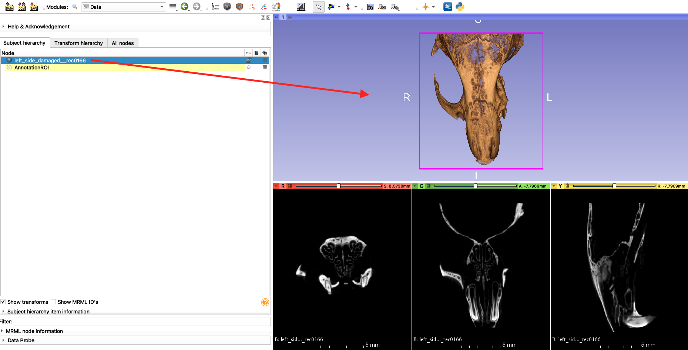

## Visualization: Volume Rendering
The `Volume Rendering` module provides interactive visualization of 3D image data. For [**official documentation of the panel and functions, see here**](https://slicer.readthedocs.io/en/latest/user_guide/modules/volumerendering.html).

* Only scalar volumes can be used for volume rendering. Vector volumes (eg jpg, png, bmp, or other classic 2D formats) can be converted to scalar volumes using the [VectorToScalarVolume module](https://www.slicer.org/wiki/Documentation/Nightly/Modules/VectorToScalarVolume). If you used SlicerMorph's `ImageStacks` module to import your data, vector to scalar conversion was done already at the time of import the data.

One quick way to render your volume is using the drag and drop function. In the `Data` module you can drag the mouse skull volume from the image stacks example directly into the 3D widow and Slicer will guess at the settings to render the volume. 

While this may be a good starting point, there are a lot of settings you can modify to improve the rendering of your volume in the `Volume Rendering` module. 

* 3D Slicer uses volume ray casting to computes 2D images from 3D volumetric data sets. Unlike surface reconstruction, there is no estimation of object surfaces or segmentation.
* The values displayed are calculated using a transfer function that incorporates voxel intensities, material properties, and illumination.
* The opacity and color of the image can be adjusted by modifying their transfer functions in the `Volume Rendering` module.

 
 
* Slicer supports both CPU and GPU volume rendering. CPU based will always work, whether you are on a computer without a dedicated graphics card, or on a remote connection (which may not support hardware accelerated graphics), but it can be slow (unless you have dozens of cores in your cpu). GPU requires you have a dedicated graphics card with 1GB or more videoRAM and it is much faster, but it has its own limitations (see below).  
* If you have a dedicated graphics card, you may want to set the default visualization method to GPU rendering using the menu option in: Edit->Preferences 
* Always set the rendering quality to normal (this is enabled by defalt, if you opt-in for the SlicerMorph Preferences).
* The physical limits to the size of the volumes that can be rendered are determined by the graphics card RAM and MAX_3D_TEXTURE_SIZE. Every dimension of the image must be less than the value of the MAX_3D_TEXTURE_SIZE and the full dataset must fit into GPU’s RAM. For the full discussion on these limits, see the Slicer discourse thread [here](https://discourse.slicer.org/t/what-spec-gpu-is-required-for-gpu-volumentric-rendering/1596).
* Driver issues: To configure laptops with two GPUS see [this discussion](https://discourse.slicer.org/t/can-i-choose-which-gpu-to-use/3149)

### Example: Volume Rendering 
1. Load the MRHead volume from the `Sample Data` module.
2. Open the `Volume Rendering` module. In the **Volume** field, make sure the volume MRHead is selected. Click the eyeball next to the **Volume** field to display the image. You can change the 3D Slicer layout to 3D only. (Alternatively, you can drag and drop the MRHead from the `Data` module into the 3D viewer directly.)

3. Expand the **Advanced** tab to view the opacity and color transfer functions. You can click on these functions to move or add additional control points.

4. Under the **Display** tab, click on the **Select a Preset** menu. This menu contains saved transfer functions that work well for common data types. Select **MRI Default** (row 4, column 5). Try adjusting the color and opacity functions of this suggested display setting.

5. See the [Panels and their Uses section](https://slicer.readthedocs.io/en/latest/user_guide/modules/volumerendering.html#panels-and-their-use) of Slicer documentation for explanation of each those panels found under the **Advanced** tab. 

### Saving your transfer functions
If you design an nice transfer function for your dataset, you can save it to the disk so that you can reuse for similar datasets. You can even convert your favorite transfer functions as 'presets' that are loaded into Slicer. See this [thread on this slicer forum about how to enable this functionality](https://discourse.slicer.org/t/i-want-to-boot-up-with-my-very-own-color-map-and-a-black-background/16383/11). In future you will be able to add your favorite transfer functions as presets (or remove existing presets). You can [follow the progress of this feature here](https://github.com/Slicer/Slicer/issues/5505)

### Turtle dataset

With carapace, skull and soft tissue, turtle skull CT (from DICOM tutorial) is a good dataset to practice your volume rendering skills. Try to highlight skull vs soft-tissue and try to visualize both at the same time. 

