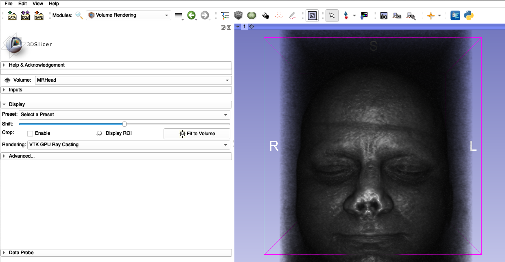

## Visualization: Volume Rendering
The `Volume Rendering` module provides interactive visualization of 3D image data. For [**official documentation of the panel and functions, see here**](https://slicer.readthedocs.io/en/latest/user_guide/modules/volumerendering.html).

* Only scalar volumes can be used for volume rendering. Vector volumes (eg jpg, png, bmp, or other classic 2D formats) can be converted to scalar volumes using the [VectorToScalarVolume module](https://www.slicer.org/wiki/Documentation/Nightly/Modules/VectorToScalarVolume). If you used SlicerMorph's `ImageStacks` module to import your data, vector to scalar conversion was done already at the time of import the data.

One quick way to render your volume is using the drag and drop function. In the `Data` module you can drag the mouse skull volume from the image stacks example directly into the 3D widow and Slicer will guess at the settings to render the volume. 

While this may be a good starting point, there are a lot of settings you can modify to improve the rendering of your volume in the `Volume Rendering` module. 

* 3D Slicer uses volume ray casting to computes 2D images from 3D volumetric data sets. Unlike surface reconstruction, there is no estimation of object surfaces or segmentation.
* The values displayed are calculated using a transfer function that incorporates voxel intensities, material properties, and illumination.
* The opacity and color of the image can be adjusted by modifying their transfer functions in the `Volume Rendering` module.

 
 
* Slicer supports both CPU and GPU volume rendering. CPU based will always work, whether you are on a computer without a dedicated graphics card, or on a remote connection (which may not support hardware accelerated graphics), but it can be slow (unless you have dozens of cores in your cpu). GPU requires you have a dedicated graphics card with 1GB or more videoRAM and it is much faster, but it has its own limitations (see below).  
* If you have a dedicated graphics card, you may want to set the default visualization method to GPU rendering using the menu option in: Edit->Preferences 
* Always set the rendering quality to normal (this is enabled by defalt, if you opt-in for the SlicerMorph Preferences).
* The physical limits to the size of the volumes that can be rendered are determined by the graphics card RAM and MAX_3D_TEXTURE_SIZE. Every dimension of the image must be less than the value of the MAX_3D_TEXTURE_SIZE and the full dataset must fit into GPU’s RAM. For the full discussion on these limits, see the Slicer discourse thread [here](https://discourse.slicer.org/t/what-spec-gpu-is-required-for-gpu-volumentric-rendering/1596).
* Driver issues: To configure laptops with two GPUS see [this discussion](https://discourse.slicer.org/t/can-i-choose-which-gpu-to-use/3149)

### Example: Volume Rendering 
1. Load the MRHead volume from the `Sample Data` module.
2. Open the `Volume Rendering` module. In the **Volume** field, make sure the volume MRHead is selected. Click the eyeball next to the **Volume** field to display the image. You can change the 3D Slicer layout to 3D only. (Alternatively, you can drag and drop the MRHead from the `Data` module into the 3D viewer directly.)

3. Expand the **Advanced** tab to view the opacity and color transfer functions. You can click on these functions to move or add additional control points.

4. Under the **Display** tab, click on the **Select a Preset** menu. This menu contains saved transfer functions that work well for common data types. Select **MRI Default** (row 4, column 5). Try adjusting the color and opacity functions of this suggested display setting.

### Saving your transfer functions
If you design an nice transfer function for your dataset, you can save it to the disk so that you can reuse for similar datasets.

### Turtle dataset

With carapace, skull and soft tissue, turtle skull CT (from DICOM tutorial) is a good dataset to practice your volume rendering skills. Try to highlight skull vs soft-tissue and try to visualize both at the same time. 

### Example: SlicerAnimator
The `Animator` module helps create and export animations in mp4 or GIF format. The animations are created by visualizing a volume and adjusting the rotation, ROI cropping, and rendering properties. A demo video of this module is also available [here](https://youtu.be/9GBekYcJR4E). `Animator` module is based on Slicer's `ScreenCapture` module which provides similar, but more limited functionality. See documentations for:
   * [Animator](https://github.com/SlicerMorph/SlicerMorph/tree/master/Docs/Animator)
   * [ScreenCapture](https://www.slicer.org/wiki/Documentation/Nightly/Modules/ScreenCapture)

1. Load the MRHead volume from the `Sample Data` module.

2. Open the `Volume Rendering` module. In the **Volume** field, make sure the volume MRHead is selected. Click the eyeball next to the **Volume** field to display the image. Under the Display Menu, adjust the Shift sliderbar to optimize 3D visibility. For `Animator` to work correctly, you have to complete this step and enable the volume rendering. 

2. Open the `Animator`  module. In the Animation Parameters dropdown menu, select the option to create a new animation. 

3. Select the **Add Action** button and choose **CameraRotationAction** from the menu. A CameraRotation action will be added to the Action menu. The properties of the rotation can be adjusted using the **Edit** button. To preview the animation, select the play button. 

4. Select the **Add Action** button and choose **ROIAction** from the menu. Two ROI markups will be placed in the scene. The first ROI will be used to crop the region displayed at the start of the animation and the second will be used to crop the region displayed at the end of the animation. To adjust the placement of the ROIs, switch to the `Data` module and turn the visibility of the ROI markups on. Place the Start ROI around the whole head. Place the second ROI inside the brain. Return to the `Animator` module to preview the effect of this action. 

5. Select the **Add Action** button and choose **VolumePropertyAction**. The volume property action allows your animation to transition from one set of rendering properties to a second set. To use this effect, you will need to create three sets of volume properties. The first will control the rendering at the beginning of the animation, the second will control the rendering at the end of the animation, and the third is an arbitrary set of properties that will be used to store the volume's display properties as they are updated. To create the properties, click the **Edit** button next to the volume property action that you added to the Actions list. Note that three property sets are created  named **Start VolumeProperty**, **End VolumeProperty**, and **VolumeProperty**. 

6. Open the `Volume Rendering` module and expand the **Inputs** menu. In the Property drop-down menu, select **Start VolumeProperty**. The current rendering will be displayed at the start of the animation. Adjust the color mapping and opacity. 

You can repeat this process for the **End VolumeProperty**, but in this example we will use preset display properties for the final animation rendering. In the display menu, click the **Select a Preset** button and choose **MR-default**. This will display the volume as it will appear at the end of the aniamtion. Before leaving  the `Volume Rendering` module, return to the property menu and select **VolumeProperty**. It is critical that this is the final active property selected when leaving the `Volume Rendering` module.

7. Open the `Animator` module. Click the **Edit** button next to the Volume Property action in the Actions menu. Select the Start VolumeProperty as **Start VolumeProperty**, End VolumeProperty as **MR-default** and the Animated VolumeProperty as **VolumeProperty**. Click the **OK** button and preview the animation using the play button.

8. When you are done adjusting the animation parameters, Select an output file location in the Export menu and click the **Export** button to save your animation.

[Here is video generated by the SlicerAnimator](https://www.youtube.com/watch?v=oGtvTOhIFtA)

**NOTE:** To be able to create an volume rendering animation that fades out and than fades in, you will need to have two Volume Property actions. One needs to start from an opaque volume rendering setting, which gradually becomes translucent (the fading out part). For the fading in (ie., second volume property action), you will need to swap the orders (i.e., begin with translucent one and end with opaque). For interpolations to work correctly, scalar opacity transfer functions should have identical number of control points (if you begin with a three point ramp, you can only continue to use three control points). Volume property nodes cannot be cloned via the `Data` module, easiest is to save and then reload the same volume property multiple times.    

## SAVING Output
You can output the result of your animation either as as a sequence of rendered frames, or as a video in MP4 format. Former gives you more control over post-processing of output (e.g., you can import the sequence into video maker software, enhance contrast or add text or additional things). Directly outputting the video in MP4 format requires FFMPEG toolkit to be installed into Slicer. In Windows and Mac, the first time you use the Animator to save in MP4, Slicer will offer you to donwload the binaries from the internet. In Linux, this is not automatic and you need to build the FFMPEG toolkit from the source. Since SlicerMorphCloud is based on Linux, you won't be able to output as MP4. 
