# SlicerMorph Module: Generalized Procrustes Analysis (GPA) Module

## Preliminary Step
Review your *Temp* and *Cache* folder settings under **Edit->Application Settings** menu. Make sure these two point to folders that you can easily access (e.g., **C:/SlicerTemp/** for **Temp** and **C:/SlicerTemp/RemoteIO** for **Cache** folders. Putting these into a folder on your desktop is fine too). That's because we will use the `Sample Data` module to download some datasets directly into your **Cache** folder, and you will to find where they are to work with them. 

### Mouse Dataset 

1. Search for `Sample Data` module and scroll down to find the SlicerMorph section. Click on **Mouse Skull Landmarks**. This will download a file called `Mouse_Skull_LMs.zip` into your Cache folder, and automatically uncompress it into a subfolder at the same place as the zip file. Please check the folder contents and note that there are 126 fcsv files. You can drag'n'drop one of the fcsv files into Slicer and see that it contains 55 landmarks (you may need to hit the center field of view button in 3D rendering window). Once you verify your contents hit `CTRL + W` to empty your Slicer scene.

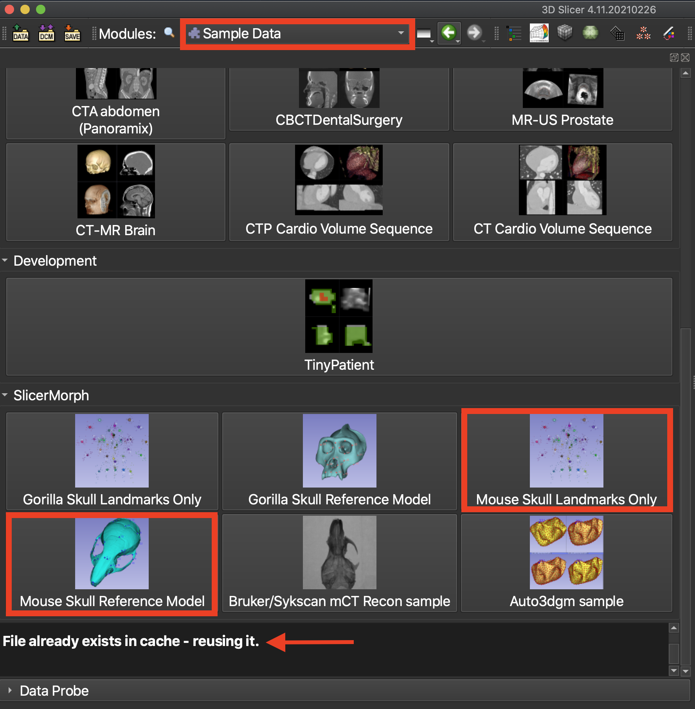

2. Search for `GPA` module. You layout will switch to having two 3D rendering window, a single slice view, a chart view and a table view. The module has three tabs that partition the workflow. The first tab, `Setup Analysis` will load the data and run the GPA/PCA.

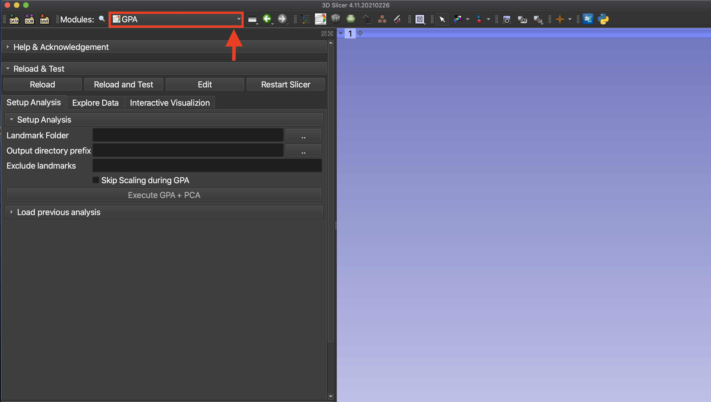

3. Click on the `..` button next to the `Landmark Folder` and navigate to your Mouse_Skulls_LMs subfolder from the previous step. 

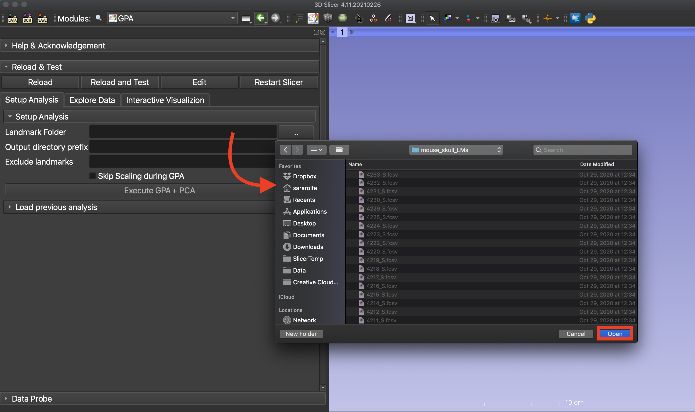

4. Click on the `..` button next to the `Output Folder` to specify where GPA module will save its out put (choosing the same folder as the previous one is fine). GPA module will create a time-stamped output folder each time you execute an analysis, so the results will not get overwritten. 

5. Do not enter any landmarks to skip, and leave `Skip Scaling during GPA` unchecked, and hit `Execute GPA + PCA`.

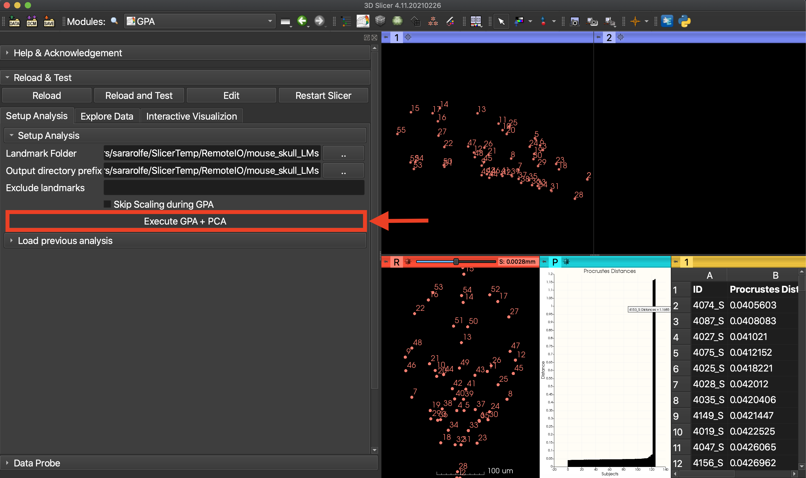

6. Switch your file explorer in your computer, navigate to the `Mouse_Skulls_LMs` folder and see a new file with a date stamp was created. Go into the folder and note five CSV files that contain eigenvalues, eigenvectors, mean shape, PC scores, and combined output that contains new procrustes aligned coordinates, centroid sizes and Procrustes distances from the output. If you want to do more specific analysis, these will be files you will import into R/geomorph or other shape analysis packages. 

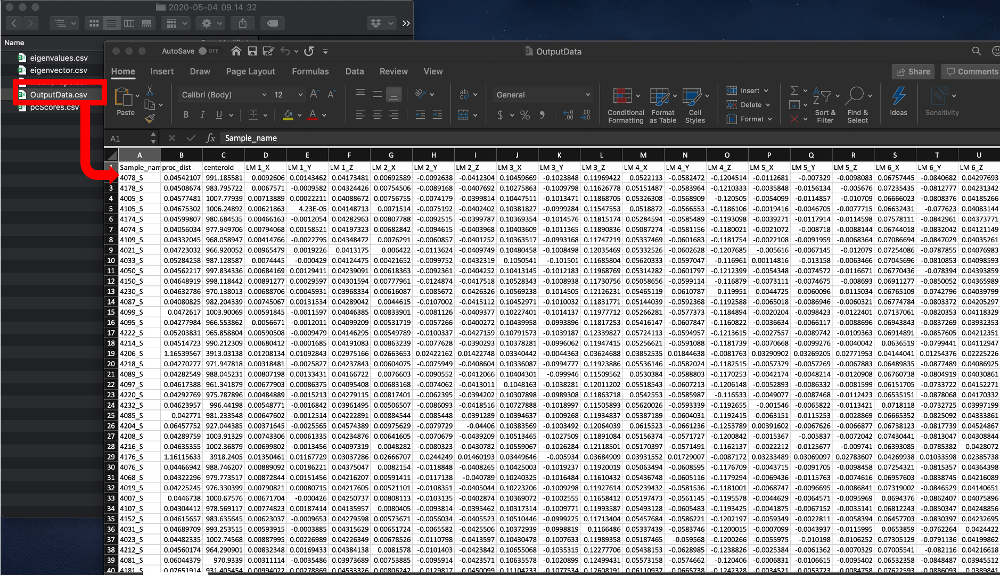

7. At this point your Plot and Table window should populate with a histogram-like bar plot of Procrustes Distances, and a table that indicates specimen names sorted by Procrustes Distance. This is a good time to see some unique features of these two windows (such as interaction, being able to zoom in into a plot etc).

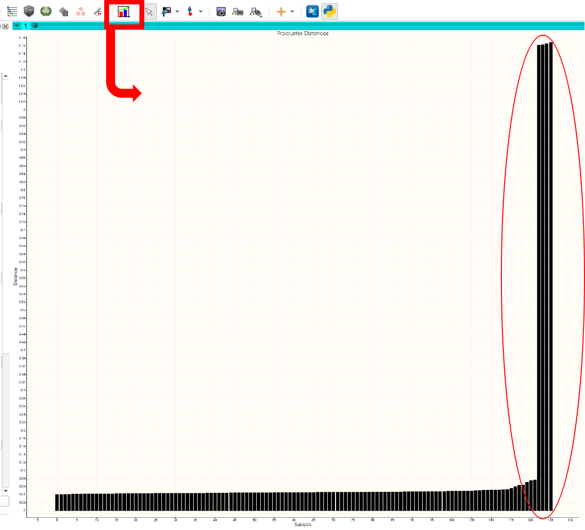

8. Scroll down to the bottom of the Table view to see that there are four specimen with very very high PD values. The shape of the PD plot also indicates there is something very different about these four specimens. 

9. Likewise PCA Scatter plot options displays a suspiciously high variance (~98%) for PC1. Go ahead and choose PC1 for x-axis, PC2 for y-axis and hit `Scatter Plot` button. 

10. Note that plot window now changed to `PCA Scatter Plot` from Procrustes Distance plot. You can enlarge this plot by selecting the "Plot only" layout from the layouts menu. If you expand the Plot window toolbar, you will see a field called Plot Chart that will let you go back and forth between plots created. Go and try switching back to Procrustes Distance plot and back to PCA scatter plot. 

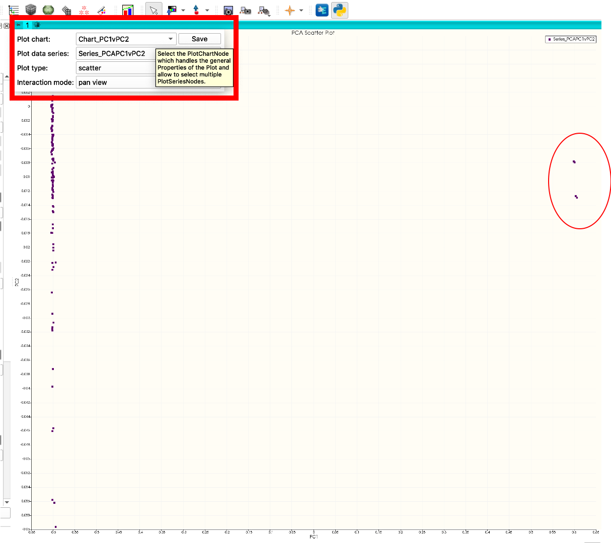

11. Hover over the four data points on the right-hand side of the PC1 axis and note that they are the same four specimens with the highest PD (you will need to zoom in to see them individually). So what is going on?

12. To access further data visualization tools, switch to the `Explore Data` tab of the GPA module. To visualize the PC1 vectors, go to the `Lollipop Plot Options` section and set the Vector One to PC1, then hit the `Lollipop Vector Plot` button. This set will automatically enable landmarks for the estimated mean shape and place eigenvector associated with PC1. By convention, this indicates how mean shape will change along the positive values of the selected PC. You should see that no other vector apart from LM25 is visible, thus PC1 (and almost all shape variation in this dataset) is influenced by LM25. This is a sign off trouble with this dataset. (HINT: If you toggle the `mean shape visibility` on and off, you will be able to see the other vectors.). Interact with the 3D window and note that you can zoom in/out as usual, and rotate. At this point, you can use either Viewport #1 or #2. 

13. To further convince ourselves of the issue, you can get a sense of variance associated with each landmark by plotting them as either spheres (averaged across three dimensions), or ellipse (all axes are independently calculated). You can see that LM25 has variance orders of magnitude larger than the others, and it is pancake like appearance suggest that it is confined to two dimensions. 

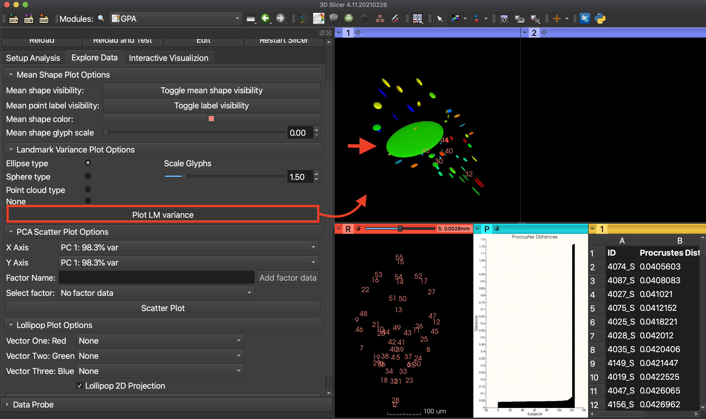

Plotting the point cloud from the landmark variance shows that four points from the landmark 25 cluster were placed at the origin. Clearly LM25 in these four specimens have an issue, and is better left out of the analysis. 

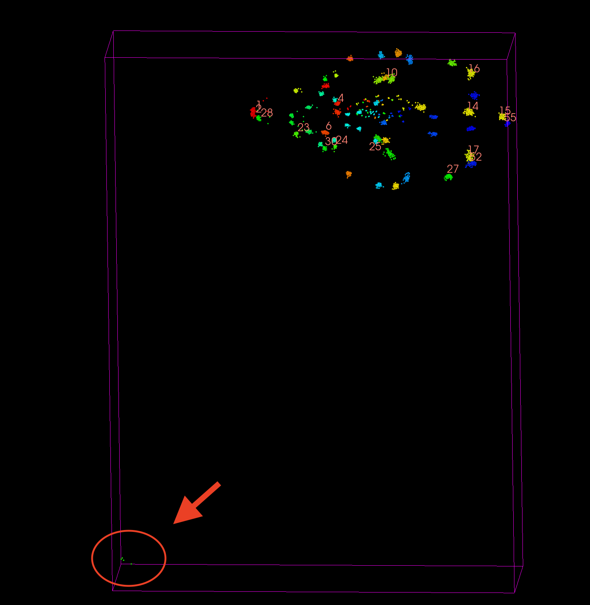

14. To repeat the analysis without LM25, first we need to clear our scene. Hit the `Reset Scene` button at the bottom of the GPA module and note that everything created by this module is removed. 

15. Now return to the  `Setup Analysis` tab of the module and repeat the step #1 above. It should remember the last folder you open. This time you will enter 25 to `exclude landmarks` field to conduct the analysis without LM25. 

16. Review the outputs and confirm that the Procrustes distance bar plot and PC1xPC2 scatter plot have been updated and no longer show the outliers observed in the previous run. 

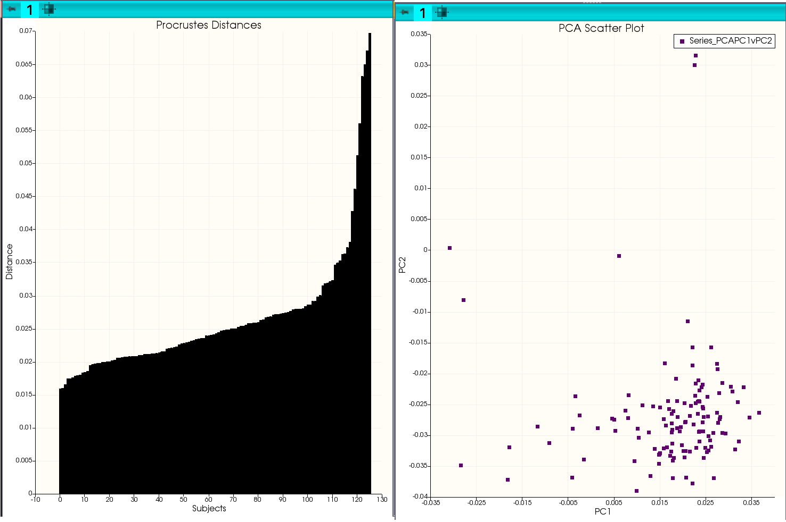

Try things like projecting the results in 2D Slice viewer, which you can switch the plane like in normal slice view you have been viewing. Unfortunately, it doesn't automatically center the field of view like scans we have been loading, thus you need to use your `left` and `middle` mouse clicks to zoom in/out and pan the field of view manually. Trying having more than one PC plotted as lollipop plots etc...

### Visualizing PCA results using a 3D model. 
So far we have been looking at output of our PC analysis as series of vectors. With 55 LMs, it might be difficult to interpret what's going on, or judge the relative importance of these vectors. The alternative is to find a `reference model` and first warp to mean shape using Thin Plate Splines. That's because our PCA space is centered on the mean shape of our population and all shape changes are defined with respect to this mean shape. If you provide a 3D model (supported formats are vtk/ply/stl/obj) and its associated set of landmarks, SlicerMorph GPA module with automatically do this for you. Alternatively, if you have no model, you can set up the 3D visualization with the meanshape and visualize the PC deformations acting on the landmark points only. 

1. Go back to the `Sample Data` module, scroll down to SlicerMorph section and click on `Mouse Skull Reference Model`. This action will create two files in your cache folder called `4074_S_lm1.fcsv` and `4074_skull.vtk`. 

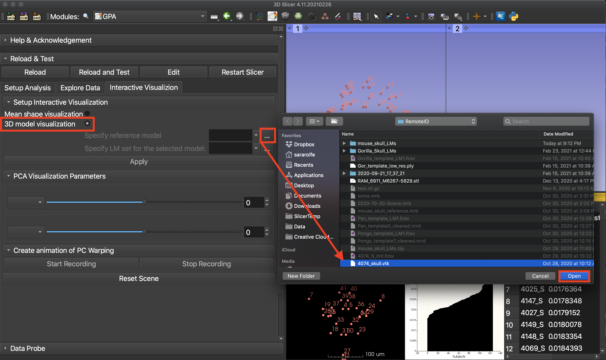

3. Go back to `GPA` module, switch to the `Setup 3D Visualization` tab and browse to the location of the landmark (FCSV) and model (VTK) files in your cache. Select `Apply`. You will now see a gray  and blue mouse skull in your viewports. Gray represents the mean shape, and blue one represents the mean shape warped along specified PC axes and scores. 

4. Go to `PCA Visualization Parameters` and set the first slider to PC1, and start deforming the mean shape along it. Try adding PC2 (or others)

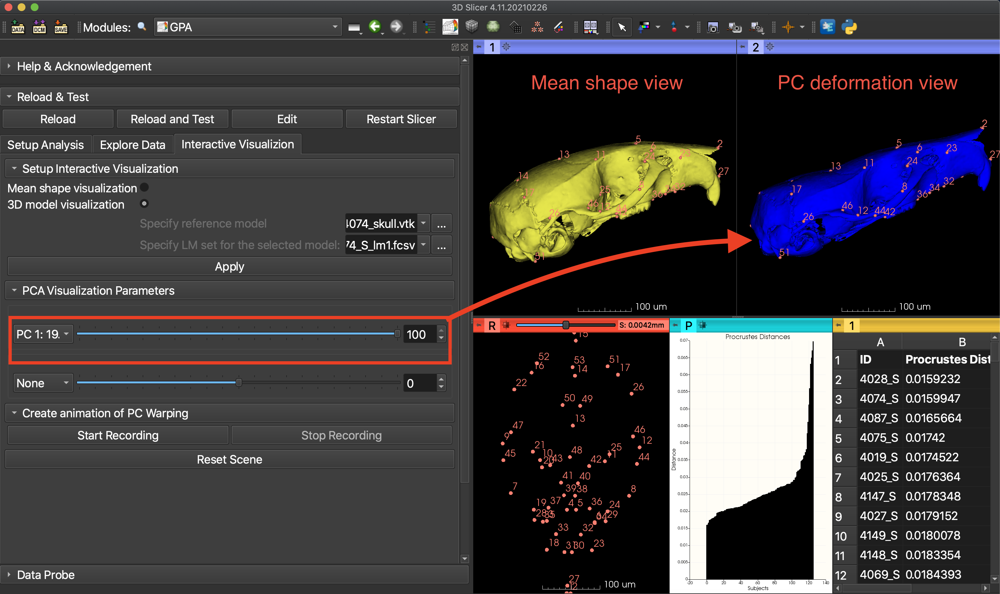

5. To capture a PC deformation as an animation, go to the 'Create animation of PC Warping' menu and hit 'Start Recording'. Move the PC Sliders to create the deformations that will be in the exported animation. After applying the deformations, hit 'Stop Recording'.

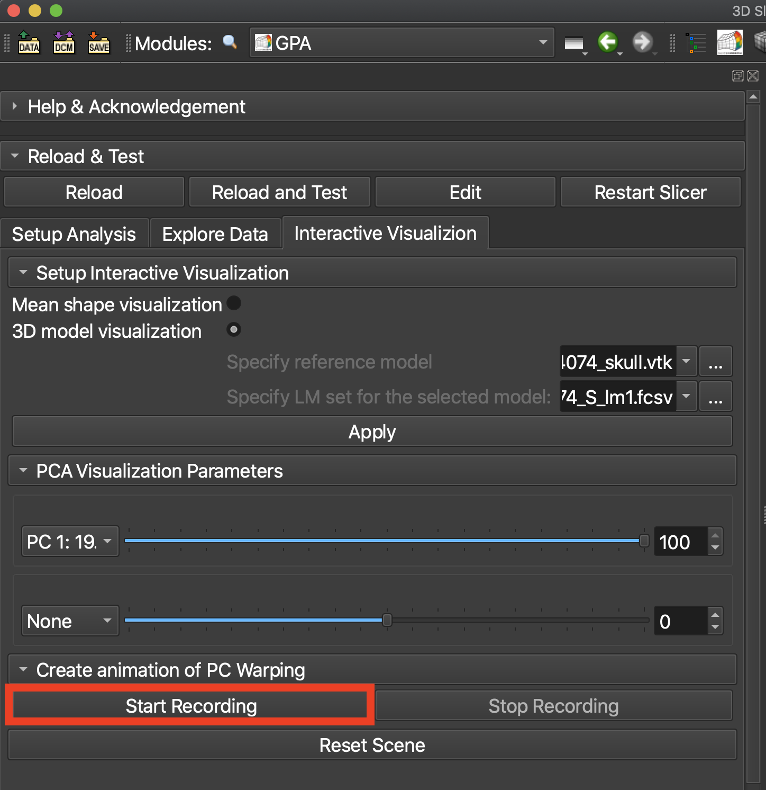

6. When the recording is stopped, the Sequences module will automatically open and show the image sequence browser that has been created, titled 'GPASequenceBrowser'. This contains the sequence of images generated during the recording. Select the play button with the green arrow icon to review the images as an animation.

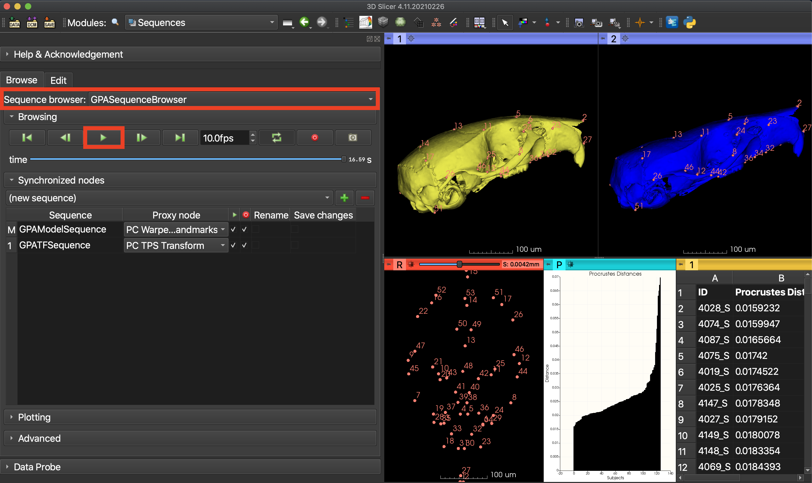

7. To export the animation created, use the search bar to switch to the Screen Capture module, which supports video exports. Set the 'Master view' to "'View2' to export only the animation from the PC deformation 3D viewer. Select the 'Animation mode' to 'sequence' to set the sequence browser created in the previous step as the source of the animation and confirm that the sequence titled 'GPASequenceBrowser' is selected. To export as an MP4 format video, go tp the 'Output' menu  and set the 'Output type' to 'video. Confirm the export properties and hit 'Capture' to start the export.

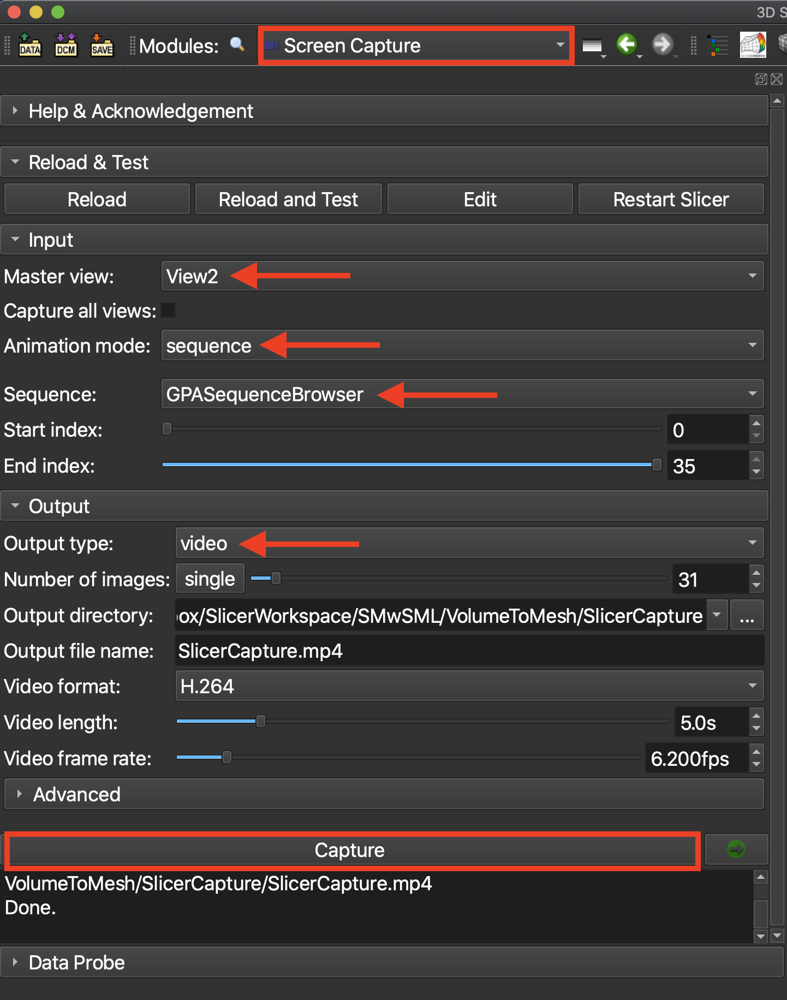

8. To view the animation created, you can browse to the output file location specified in the Screen Capture module, or click the button with the green arrow icon next to the 'Capture' button. This will open a popup with the exported animation.

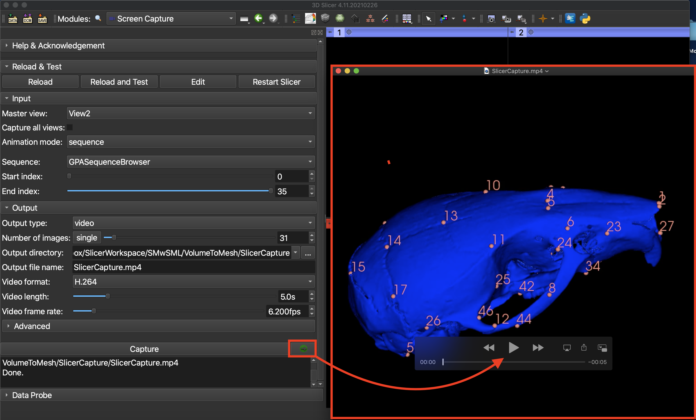

### [Videos of GPA tool functionality on the SlicerMorph youtube channel:](http://bit.ly/SM_youtube)
