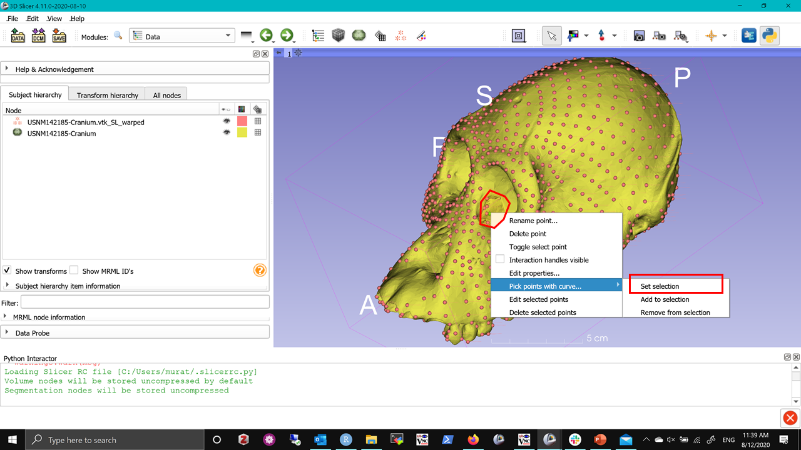
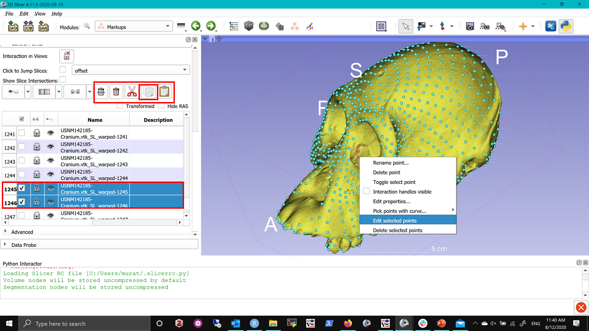
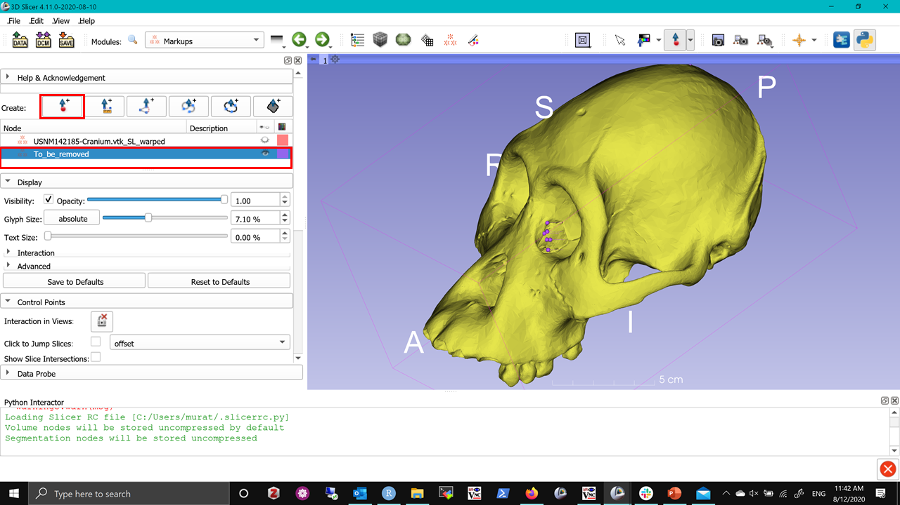

## MarkupEditor Use Cases

While semiLM tools like spherical sampling or patch-based semiLMs are useful in densely sampling a complex geometry for shape analysis, there might be occassional points that are dropped of the surface for various reasons (e.g., a damaged specimen missing a section). Because GPA requires existence of identical set of landmarks, you either have to remove that sample from the analysis, or remove those problematic points. Since you probably have hundreds of semiLMs the latter makes more sense. The primary challenge is these methods do not necessarily provide LMs in any sort of order. Identifying the indices and labels of the few you want to remove may take some time. 

Also, it in other scenario where you have created a template of hundreds of semiLMs from a skull, you may want to assign them into anatomical regions (neurocranium, splanchnocranium, basicranium so forth) or subset them so that you can run integration and/or modularity analyses. Again, this is not easy task, as the landmarks are not necessarily in any order.

`MarkupEditor` tries to address these concerns by enabling you interact with a set of landmarks, selecting a subset by drawing a curve in 3D viewer. This is a very new module and some of the functionality (such as selecting only visible points on the curve) is not yet implemented. But even as it is, we expect it to be quite useful for you. Similar to `ExportAs` `MarkupEditor` is a SlicerMorph specific function, that enables a right-click context menu when you hover over a fiducial in the 3D viewer and right-click on it.  

To use the tool:

1. Download the [this sample scene](https://app.box.com/s/js6pzazedgr0wqe0ibrcwqpaf6jsd7r2) and drag and drop into Slicer. This is an example of a semiLM set created spherical sampling method. 

2. Note that some holes in the orbits, particularly around orbital canal that caused some of the semiLMs to go inside the brain case and nasal septum. These are unlikely to be good landmarks to include in the analysis. We can use the `MarkupEditor` to identify their indices. Hover over to one of the points you like to remove and right-click to bring the context menu and choose **Pick Points with a curve -> Set Selection** options. And outline the patch of semiLMs shown picture below using the provided curve tool.

3. See that every other LM is now set to color blue (which is unselected state. You may want to review the Markup modules display option to see how colors are decided). Again hover over with your mouse to one of these points, right-click and choose **Edit Selected Points**. Then go to `Markups` module and expand the control points. If you scroll down on the list, you will see a number of rows highlighted in blue and they have a checkmark next to them (selected state). We can now copy/paste/delete these individual points. For this exercise click the copy button.

4. Now scroll to the top the `Markups` module and create a blank fiducial node and rename it to something like **to_be_removed** and set it is color to something distinct then blue and red. While making sure this is the active fiducial node, go down to control points (which should be blank), and hit the paste button and see that the LMs we selected in step 2 are now in their own list. 

**One your own:** 

1. Practice other options of **Pick Points with curve:** such as **add to selection** or **remove from selection**
2. Try splitting the full landmark set into two mutuall exclusive sets of **facial_LMs** and **neurocranium_LMs** 

**Important:** MarkupEditor is a new addition to the SlicerMorph, your input will improve the feature. ~~

