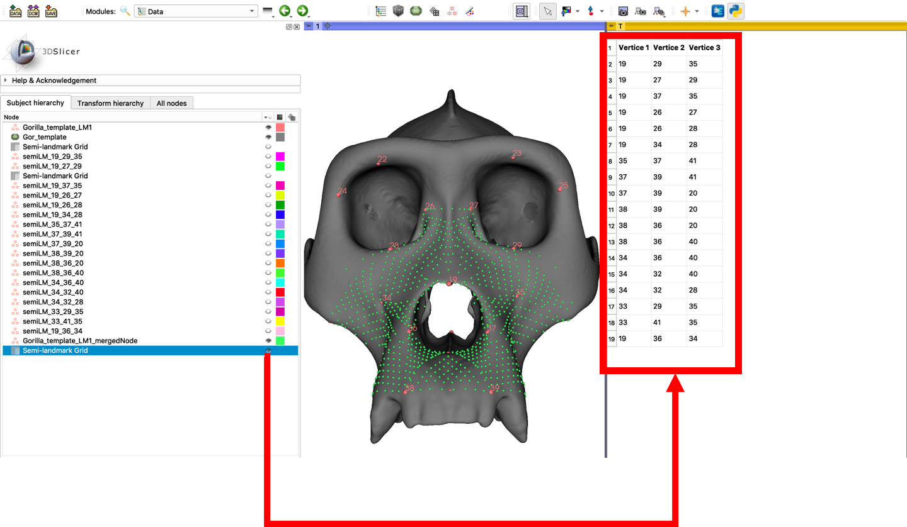

## Placing patches of semi-landmarks between anatomical (Type I) landmark points

This method uses three landmarks already placed on the specimen to define a triangular region where semi-landmarks will be placed. A template triangular grid with a user-specified number of semi-landmark points is registered to the vertices of the bounding triangle using a thin-plate-spline deformation. The vertices of the triangular sampling grid are then projected to the surface of the specimen along the estimated normal vectors. After the projection step, the landmark points can be merged together and a curve of semi-landmarks placed along each unique triangle edge in the grid. The semi-landmarks can be generated for an individual sample or placed on other samples using a thin-plate spline (TPS) transform.

1. Download the Gorilla Skull Reference Model from the 'Sample Data' (will be in your Cache folder). Load the mesh (PLY) and landmark file (FCSV) into Slicer.

2. Switch to the SemiLandmark module. It is found under the SlicerMorph Labs menu, or can be opened using the search bar. You will see the landmarks loaded are displayed in the module's landmark node viewer. Use the selection boxes to select the loaded mesh as the model and the loaded landmarks as the active landmark set.

3. Now, you can enter the landmark numbers of three points to place the first patch. In the 'Semi-landmark grid points' field enter: 19, 29, 35. You will see that a triangular patch is placed at this point, and a new landmark node shows up in the landmark node viewer, named by the bounding landmark points of the triangle. 

4. You can edit this node using the right-click menu, or by switching to the 'Markups' module. From here, the glyph size and color can be adjusted for visibility and the landmark points can be edited.

 

5. If the semi-landmark patch was placed successfully, more patches can be placed. If the placement failed, this patch can be deleted or replaced. If the underlying geometry is not approximated well by a triangular patch, different coordinates should be used. If the point placement failed due to a secondary surface or noise in the mesh surface, the advanced properties of the SemiLandmarking module can be used to optimize placement. In the case of points placed on the incorrect mesh surface (eg interior surface, neighboring structure), the maximum projection distance should be adjusted. In the case of noise on the mesh surface, the landmark points may not provide a reasonable estimate of the patch surface normal. Increasing the smoothing of the surface normals used for projection can mitigate this.

6. Apply patches of semi-landmarks until the region of interest is covered. Here, we have placed 18 triangular patches. 

7. In the landmark node viewer, select the nodes to be merged into the final set of semi-landmarks. Here, every semi-landmark node has been selected (it is not necessary to select the original landmark node). Click the 'Merge highlighted nodes' button'. Depending on the number of semi-landmarks, this step may take a few minutes.

8. A new, merged semi-landmark node is now displayed in the landmark node viewer containing the patch landmarks and curves placed along each unique triangle edge.

9. Switch to the data browser and find the table 'Semi-landmark Grid' displayed in the 'Subject hierarchy' menu. Click the eye next to the table to view a list that specifies the landmark number at each patch vertex in the merged landmark set. This can be used to apply semi-landmarks to new images using the same patch-placement.  

 

10. From the 'Data' node viewer, right click on the merged semi-landmark node. Choose 'Export as' from the menu and select the option to export as an .FCSV file. This 'Export as' option can also be accessed from the landmark node viewer in the 'Markups' module or the 'Semi-landmark' module. Use 'Export as' from the 'Data' module to save the table containing the semi-landmark grid connectivity as a .CSV file. 

 

If you are saving multiple nodes, or would like to save the entire scene, you may choose to use the built-in 'Save as' dialog box. Click the 'Save' icon in the top toolbar to pull up the standard menu of export options for each node in the scene. 

 

11. The table of grid vertices can be used to apply the same semi-landmark patches to new samples using the 'TransferSemiLandmarks' module. Or, the 'TransferSemiLandmarksWarp' module can be used to transfer the semi-landmarks from the template across subjects using a TPS transform. Open the 'TransferSemiLandmarksWarp' from the SlicerMorph Labs menu. The 'Base mesh' and 'Base landmarks'  can be set to the template and landmarks loaded in the scene. The 'Base semi-landmarks' should be set to the merged set of semi-landmarks created in this exercise. By specifying a directory of sample meshes and landmarks, the module will write a semi-landmark file for each sample to the output directory.

 
