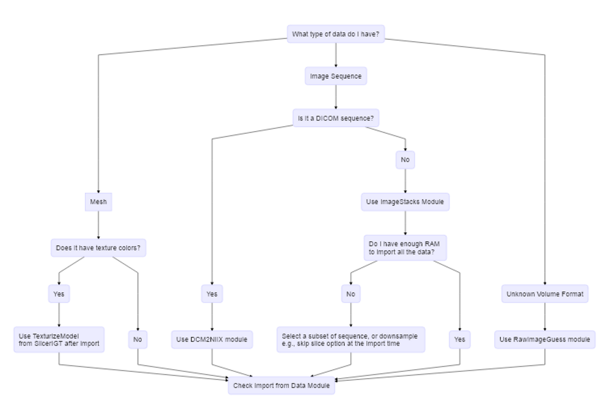
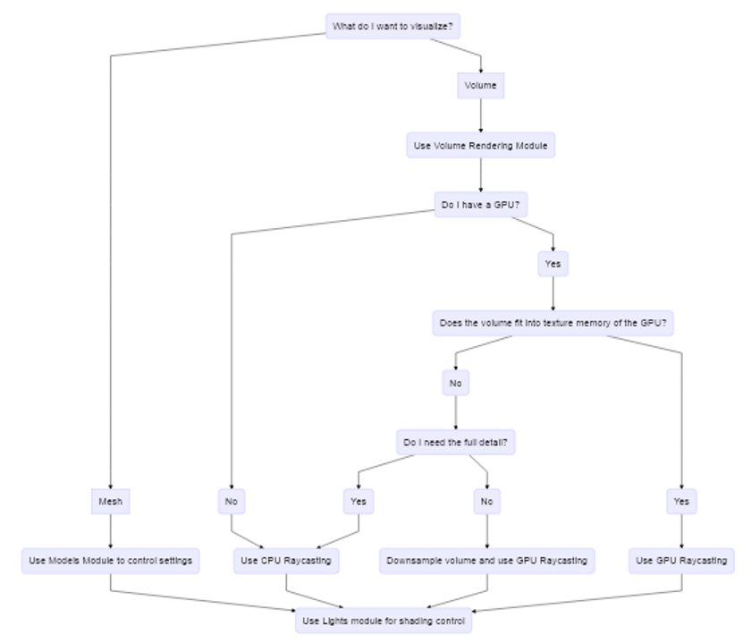
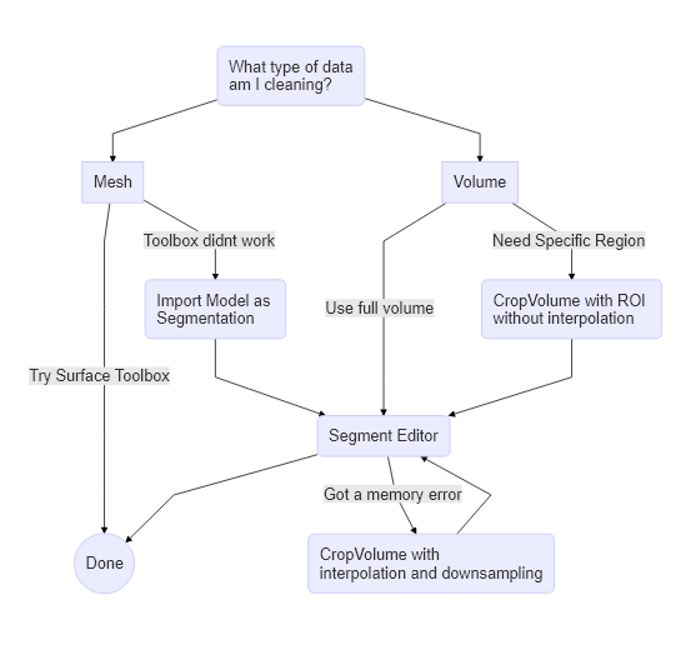
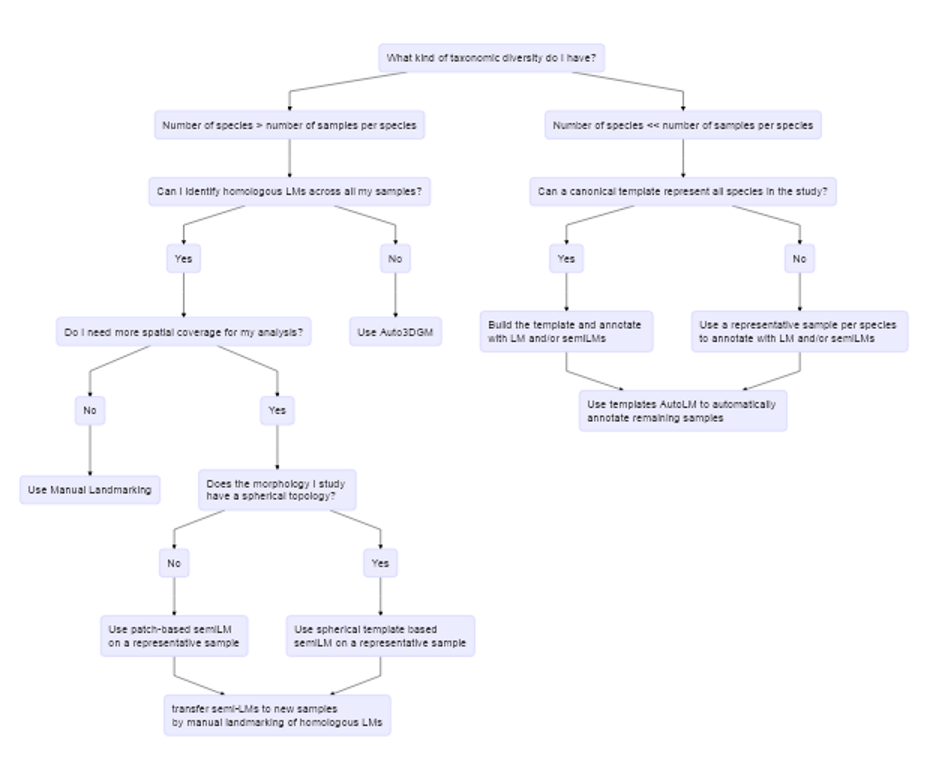

## Decision Trees
We provide some decision trees for common tasks that new users want to accomplish with SlicerMorph. In Slicer there are usually multiple ways of accomplishing the same task, as such these are not the only options. Please take them as suggestions.

### Data Import

### 3D Visualization

### Data Cleanup (segmentation)

### Landmarking

