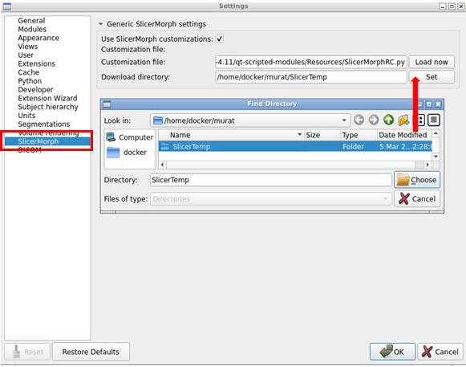

## SlicerMorphCloud Instructions
During the course you will be provided unique URL and passwords to access your own SlicerMorphCloud instance. You can either use a web browser (Firefox, Chrome) or a free software called TurboVNC. You can download and install TurboVNC from https://sourceforge.net/projects/turbovnc/files/2.2.6/. If you have on a slower connection, dedicated TurboVNC usually provides better experience. We suggest starting with the web browser option, but if you encounter performance issues try TurboVNC. 

**Note:** While it is the same server, addresses for web browser (starts with _http://_) and turboVNC connection (starts with something like _murat.slicermorph.org:41999_) are formatted slightly different and are not interchangable. Make sure to use the correct one for your connection option.

These cloud instances will be available through out the course 7/24 online until 3/14 midnight. They are very powerful and richly provisioned, and we encourage you to use these instead of local installation of SlicerMorph, so that we can join into your session if you encounter a problem. If you have any data you want to use after the workshop, please make sure to remove from these instance before 3/14. 

## Login in and setting it up for the first time
Paste the URL into the web browser or VNC address into TurboVNC, enter the password.

## Image quality settings
If you encounter mouse pointer lags or screen refresh issues in your web browser, you can adjust VNC connection quality settings. WAN connection setting in TurboVNC usually provides very good interactivity. 

## SlicerMorphCloud Desktop
This is a very simple Linux desktop. If you right mouse click on the screen a pop-up menu shows the applications lists. There are four applications we will be using:
* Application->Utilities->Slicer
* Application->Development->Rstudio
* Application->Utilities->File Manager PCmanFM
* Web browser (Firefox): Firefox will be the primary way to get your own data in and out of the SlicerMorphCloud instance, or download data from MorphoSource. To use your own data into SlicerMOrphCloud, first upload to cloud file service like Dropbox or Google Drive, then login to the cloud provider using the Firefox within SlicerMorph instance. 

## Where to save files? 
The desktop folders you see in SlicerMOrphCloud is a docker container. As such anything saved in those folders will be lost when docker instance has to be restarted (for example if server needs to restart). To avoid loosing data, please **ONLY** use this folder: 

/home/docker/**YOURUSERNAME** 

In the screeshot below this is **/home/docker/murat**. 
As a first step, go ahead and create two folder under this folder, using the PCManFM (Application->Utilities->File Manager) 
* SlicerTemp: We will use this folder for everything we download through SlicerMorph application 
* Misc: This is where you want to save your outputs. You can call this folder anything you like.  

After you created these folder, you can create shortcuts for them into the file manager as shown in the screenshot below:

## Installing SlicerMorph and other extensions
While the Slicer application is installed for you in the instance, SlicerMorph extension is not. You need to do this on your own using the Extension Manager of Slicer. Click the extension manager icon, switch to **Install Extensions** and type SlicerMorph in the search box and then hit install. 

SlicerMorph is going to install additional extensions that provide useful functionality. Go ahead and accept those as well as their dependencies. After the installation are complete go ahead and restart Slicer for changes to take effect. 

## Updating SlicerMorph (and other extensions)
You are using the latest stable version (r27938) of 3D Slicer. Stable releases allows users to check for updates for their already installed extensions. To do that anytime during (or after) the course, open the Extension Manager, click **Manage Extension** and then click the little dropdown button highlighted on the right and select **Check for Updates**. If an installed extension has a newer version, an update button will appear. After hitting the Update button remember to restart Slicer for changes to take effect. 

## SlicerMorph customization
Once installed, SlicerMorph provides certain customizations such as keyboard shortcuts for creating points, segmentation effect, switching layout and more. You can see the full list customization on the [official SlicerMorph documentation](https://github.com/SlicerMorph/SlicerMorph/tree/master/Docs/MorphPreferences).

These customization are not enabled by default and users needs to opt-in. To enable them, open Slicer and go to **Edit->Application Settings->SlicerMorph**, and click the **Use SlicerMorph customizations**. 

### Setting up download folder 
We will download sample data using the SlicerMorph. To make sure those are saved into the persistent folder we in previous steps, click the **Download Directory** button and point it to the one you created above (in this example it is /home/docker/murat/SlicerTemp)

### Customizing toolbar icons
Slicer provides a mechanism to add (or remove) icons of modules you frequently use to the top toolbar for convenient access. We suggest adding GPA and Volume Rendering module icons to the favorites. To do that go to Modules section of Application Settings, find the GPA under the modules tab, and drag and drop its icon to the the Favorites. You can repeat the same for volume rendering, or any other module. Similarly, we suggest changing the default start module from **Welcome** to **Data** as we will use the Data module very frequently.  

Since we are using a docker instance, we have to do a few changes to make sure SlicerMorph works as intended. None of the changes below are necessary when you are using Slicer on your own computer, but they are necessary for SlicerMorphCloud.   

### Setting the Volume Rendering to CPURaycasting
Our docker instances do not have graphics cards (also known as GPU), which is normally what SLicer uses to render 3D images. For this workshop, you will make this change so the default becomes CPU rendering. Click the **VOlume Rendering** tab and choose **CPU Raycasting**

Then click the **Views** section, and uncheck **Use Depth Peeling**. 

